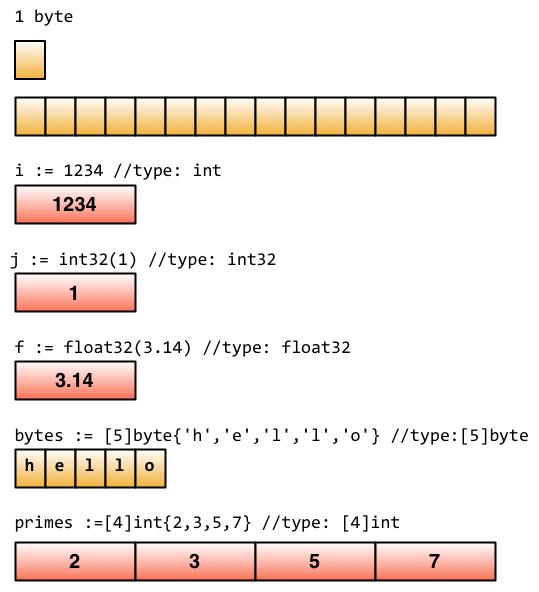
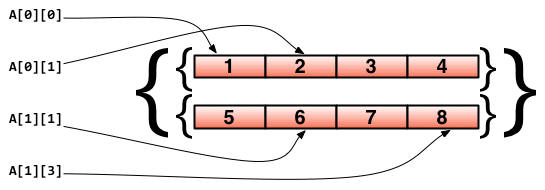
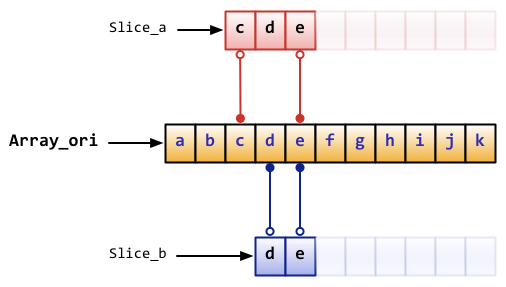
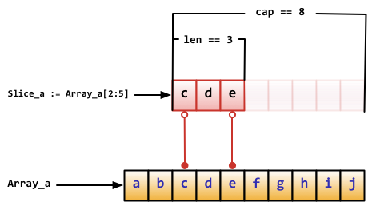
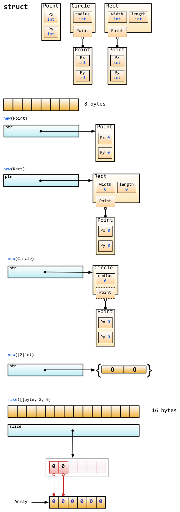

# 基本型別 & Storage

## Boolean

- 預設為 false

```go
var isAct bool; //全域宣告
var enabled, disable = true, false; //忽略型別

func test(){
    var available bool  //一般宣告
    vaild := false      //間短宣告
    available = true    //賦值
}
```

## 數值型別

### 整數型別

- Go 同時支援 int 和 uint: 長度相同

  - rune( int32 )
  - int8, int16, int32, int64
  - byte( uint8 )
  - uint8, uint16, uint32, uint64

  > 需要注意的一點是，這些型別的變數之間不允許互相賦值或操作，不然會在編譯時引起編譯器報錯。

  > 如下的程式碼會產生錯誤：invalid operation: a + b (mismatched types int8 and int32)

  > > ```go
  > > var a int8
  > > var b int32
  > > c:=a + b
  > > ```

  > 另外，儘管 int 的長度是 32 bit, 但 int 與 int32 並不可以互用。

### 浮點數

- 浮點數的型別有 float32 和 float64 兩種（沒有 float 型別），預設是 float64。
- Go 還支援複數。它的預設型別是 complex128（64 位實數+64 位虛數）/ complex64(32 位實數+32 位虛數)
- 複數的形式為 RE + IMi，其中 RE 是實數部分，IM 是虛數部分，而最後的 i 是虛數單位。下面是一個使用複數的例子：

```go
var c complex64 = 5+5i
//output: (5+5i)
fmt.Printf("Value is: %v", c)
```

### 字串( string )

_在 Go 中字串是不可變的，例如下面的程式碼編譯時會報錯：cannot assign to s[0]_

```go
var s string = "hello"
s[0] = 'c'
```

- Go 中的字串都是採用 UTF-8 字符集編碼。字串是用一對雙引號（""）或反引號（`  `）括起來定義，它的型別是 string。

```go

var frenchHello string  // 宣告變數為字串的一般方法
var emptyString string = ""  // 宣告了一個字串變數，初始化為空字串
func test() {
    no, yes, maybe := "no", "yes", "maybe"  // 簡短宣告，同時宣告多個變數
    japaneseHello := "Konichiwa"  // 同上
    frenchHello = "Bonjour"  // 常規賦值
}
```

#### 修改字串

- string > array > fix > string

```go
s := "hello"
c := []byte(s)  // 將字串 s 轉換為 []byte 型別
c[0] = 'c'
s2 := string(c)  // 再轉換回 string 型別
fmt.Printf("%s\n", s2)
```

```go
s := "hello"
s = "c" + s[1:] // 字串雖不能更改，但可進行切片(slice)操作
fmt.Printf("%s\n", s)
```

#### 連結字串

使用 `+`號連結兩個字串

```go
s := "hello,"
m := " world"
a := s + m
fmt.Printf("%s\n", a)
```

#### 多行字串

- ` 括起的字串為 Raw 字串，即字串在程式碼中的形式就是列印時的形式，它沒有字元轉義，換行也將原樣輸出。例如本例中會輸出：

```go
m := `hello
    world`
// output
hello
    world
```

### 錯誤型別 ( erorr )

`package`中有一個專門的`errors`套件處理錯誤

```go
err := errors.New("emit macho dwarf: elf header corrupted")
if err != nil {
    fmt.Print(err)
}
```

## Storage

- https://research.swtch.com/godata



- 基礎型別都是透過分配一塊相應的記憶體進行儲存

## array、slice、map

### array

宣告方式: `var arr [n]type`

- 在 `[n]type` 中，n 表示陣列的長度，type 表示儲存元素的型別。

```go
var arr [10]int  // 宣告了一個 int 型別的陣列
arr[0] = 42      // 陣列下標是從 0 開始的
arr[1] = 13      // 賦值操作
fmt.Printf("The first element is %d\n", arr[0])  // 取得資料，回傳 42
fmt.Printf("The last element is %d\n", arr[9]) //回傳未賦值的最後一個元素，預設回傳 0
```

由於長度也是陣列型別的一部分，因此 [3]int 與[4]int 是不同的型別，陣列也就不能改變長度。陣列之間的賦值是值的賦值，即當把一個陣列作為參數傳入函式的時候，傳入的其實是該陣列的副本，而不是它的指標。如果要使用指標，那麼就需要用到後面介紹的 slice 型別了。

```go
a := [3]int{1, 2, 3} // 宣告了一個長度為 3 的 int 陣列

b := [10]int{1, 2, 3} // 宣告了一個長度為 10 的 int 陣列，其中前三個元素初始化為 1、2、3，其它預設為 0

c := [...]int{4, 5, 6} // 可以省略長度而採用`...`的方式，Go 會自動根據元素個數來計算長度
```

#### 巢狀陣列

```go
// 宣告了一個二維陣列，該陣列以兩個陣列作為元素，其中每個陣列中又有 4 個 int 型別的元素
doubleArray := [2][4]int{[4]int{1, 2, 3, 4}, [4]int{5, 6, 7, 8}}

// 上面的宣告可以簡化，直接忽略內部的型別
easyArray := [2][4]int{{1, 2, 3, 4}, {5, 6, 7, 8}}
```



### slice ( 動態陣列 )

- slice 並不是真正意義上的動態陣列，而是一個參考型別。slice 總是指向一個底層 array，slice 的宣告也可以像 array 一樣，只是不需要長度。

```go
// 和宣告 array 一樣，只是少了長度
var fslice []int
```

```go
slice := []byte {'a', 'b', 'c', 'd'}
```

slice 可以從一個陣列或一個已經存在的 slice 中再次宣告。slice 透過 array[i:j] 來取得，其中 i 是陣列的開始位置，j 是結束位置，但不包含 array[j]，它的長度是 j-i。

```go
// 宣告一個含有 10 個元素 & 元素型別為 byte 的陣列
var ar = [10]byte {'a', 'b', 'c', 'd', 'e', 'f', 'g', 'h', 'i', 'j'}

// 宣告兩個含有 byte 的 slice
var a, b []byte

// a 指向陣列的第 3 個元素開始，併到第五個元素結束，
a = ar[2:5]
//現在 a 含有的元素: ar[2]、ar[3]和 ar[4]

// b 是陣列 ar 的另一個 slice
b = ar[3:5]
// b 的元素是：ar[3]和 ar[4]
```

> 注意 slice 和陣列在宣告時的區別：宣告陣列時，方括號內寫明了陣列的長度或使用...自動計算長度，而宣告 slice 時，方括號內沒有任何字元。
> 

#### Slice 操作

- slice 的預設開始位置是 0，`ar[:n]` 等價於 `ar[0:n]`
- slice 的第二個序列預設是陣列的長度，`ar[n:]` 等價於 `ar[n:len(ar)]`
- 如果從一個陣列裡面直接取得 slice，可以這樣 `ar[:]`，因為預設第一個序列是 0，第二個是陣列的長度，即等價於 `ar[0:len(ar)]`

```go
// 宣告一個陣列
var array = [10]byte{'a', 'b', 'c', 'd', 'e', 'f', 'g', 'h', 'i', 'j'}
// 宣告兩個 slice
var aSlice, bSlice []byte

// 示範一些簡便操作
aSlice = array[:3] // 等價於 aSlice = array[0:3] aSlice 包含元素: a,b,c
aSlice = array[5:] // 等價於 aSlice = array[5:10] aSlice 包含元素: f,g,h,i,j
aSlice = array[:]  // 等價於 aSlice = array[0:10] 這樣 aSlice 包含了全部的元素

// 從 slice 中取得 slice
aSlice = array[3:7]  // aSlice 包含元素: d,e,f,g，len=4，cap=7
bSlice = aSlice[1:3] // bSlice 包含 aSlice[1], aSlice[2] 也就是含有: e,f
bSlice = aSlice[:3]  // bSlice 包含 aSlice[0], aSlice[1], aSlice[2] 也就是含有: d,e,f
bSlice = aSlice[0:5] // 對 slice 的 slice 可以在 cap 範圍內擴充套件，此時 bSlice 包含：d,e,f,g,h
bSlice = aSlice[:]   // bSlice 包含所有 aSlice 的元素: d,e,f,g
```

slice 是參考型別，所以當參考改變其中元素的值時，其它的所有參考都會改變該值，例如上面的 aSlice 和 bSlice，如果修改了 aSlice 中元素的值，那麼 bSlice 相對應的值也會改變。

從概念上面來說 slice 像一個結構體，這個結構體包含了三個元素：

- 一個指標，指向陣列中 slice 指定的開始位置
- 長度，即 slice 的長度
- 最大長度，也就是 slice 開始位置到陣列的最後位置的長度

```go
    Array_a := [10]byte{'a', 'b', 'c', 'd', 'e', 'f', 'g', 'h', 'i', 'j'}
    Slice_a := Array_a[2:5]
```



#### slice 觀念

- 長度:
  - 切片的长度指的是切片当前包含的元素数量。
  - 通过内置的 len()函数可以获取切片的长度。
  - 长度反映了切片中实际存在的、可以直接访问的元素的数量。
- 容量
  - 切片的容量指的是从切片的起始元素到其底层数组末尾的元素数量。
  - 通过内置的 cap()函数可以获取切片的容量。
  - 容量决定了在不重新分配内存的情况下，切片可以增长到的最大长度。
- 兩者的差異:
  - 长度表示切片当前实际包含的元素数，而容量表示切片最多可以扩展到包含多少元素。
  - 切片的长度可以通过切片操作、append()函数等方式改变，但不会超过其容量。如果添加的元素数量超过了切片的容量，Go 运行时会自动分配一个更大的数组，并更新切片的容量值。
  - 容量是从切片的第一个元素开始计算到底层数组的末尾，因此它总是大于或等于切片的长度。

#### Slice 內建函式

- len 取得 slice 的長度

- cap 取得 slice 的最大容量

- append 向 slice 裡面追加一個或者多個元素，然後回傳一個和 slice 一樣型別的 slice

- copy 函式 copy 從源 slice 的 src 中複製元素到目標 dst，並且回傳複製的元素的個數

注：append 函式會改變 slice 所參考的陣列的內容，從而影響到參考同一陣列的其它 slice。

- 但當 slice 中沒有剩餘空間（即(cap-len) == 0）時，此時將動態分配新的陣列空間。

* 回傳的 slice 陣列指標將指向這個空間，而原陣列的內容將保持不變；其它參考此陣列的 slice 則不受影響。

從 Go1.2 開始 slice 支援了三個參數的 slice ( 完整切片表达式 )，之前我們一直採用這種方式在 slice 或者 array 基礎上來取得一個 slice

- `array[low : high : max]`

```go
var array [10]int
slice := array[2:4]
```

這個例子裡面 slice 的容量是 8，新版本里面可以指定這個容量

這邊的 2 表示起始位置
4 表示結束位置 ( 不包含自己 )
7 是這次索引的上限 ( 從 low 開始計算 不含 max) 7-2 所以這個陣列的最大容量是 5

```go
slice = array[2:4:7]
```

##### 如何利用尚未使用到的空間

append 函数可以用来向切片添加元素。如果切片的容量足够，添加的元素会占据切片容量内未使用的部分。如果切片容量不足以容纳新添加的元素，append 会创建一个新的切片，这个新切片具有更大的容量，可以包含所有原有元素加上新添加的元素。

1. 透過 `append`

```go
slice := make([]int, 2, 5) // 切片长度为2，容量为5
slice = append(slice, 3)   // 向切片添加一个元素
```

2. 直接修改切片索引处的值
   如果你知道切片的容量足够大，且想要直接修改切片后面的某个特定位置的值（这个位置在切片的当前长度之内），你可以直接通过索引操作来做。但这种方法只适用于切片已经通过某种方式（如 append）扩展到那个索引的情况。

```go
var array [10]int       // 声明一个整型数组
slice := array[2:4:7]   // 创建一个切片，长度为2，容量为5
slice = append(slice, 100) // 使用append函数扩展切片

// 现在slice包含array[2], array[3]和新添加的100，长度变为3
```

在这个例子中，尽管切片最初只包含两个元素，但利用 append，我们能够在保持底层数组不变的情况下，增加切片的长度，直到达到其容量上限。

### map

map 也就是 Python 中字典的概念，它的格式為 `map[keyType]valueType`

我們看下面的程式碼，map 的讀取和設定也類似 slice 一樣，透過 key 來操作，只是 slice 的 index 只能是｀ int ｀型別，而 map 多了很多型別，可以是 int，可以是 string 及所有完全定義了 == 與!=操作的型別。

```go
// 宣告一個 key 是字串，值為 int 的字典，這種方式的宣告需要在使用之前使用 make 初始化
var numbers map[string]int
// 另一種 map 的宣告方式
numbers = make(map[string]int)
numbers["one"] = 1  //賦值
numbers["ten"] = 10 //賦值
numbers["three"] = 3

fmt.Println("第三個數字是: ", numbers["three"]) // 讀取資料
// 顯示出來如 : 第三個數字是: 3
```

這個 map 就像我們平常看到的表格一樣，左邊列是 key，右邊列是值

使用 map 過程中需要注意的幾點：

- map 是無序的，每次顯示出來的 map 都會不一樣，它不能透過 index 取得，而必須透過 key 取得
- map 的長度是不固定的，也就是和 slice 一樣，也是一種參考型別
- 內建的 len 函式同樣適用於 map，回傳 map 擁有的 key 的數量
- map 的值可以很方便的修改，透過 numbers["one"]=11 可以很容易的把 key 為 one 的字典值改為 11
- map 和其他基本型別不同，它不是 thread-safe，在多個 go-routine 存取時，必須使用 mutex lock 機制
- map 的初始化可以透過 key:val 的方式初始化值，同時 map 內建有判斷是否存在 key 的方式

透過 delete 刪除 map 的元素：

```go
// 初始化一個字典
rating := map[string]float32{"C":5, "Go":4.5, "Python":4.5, "C++":2 }
// map 有兩個回傳值，第二個回傳值，如果不存在 key，那麼 ok 為 false，如果存在 ok 為 true
csharpRating, ok := rating["C#"]
if ok {
    fmt.Println("C# is in the map and its rating is ", csharpRating)
} else {
    fmt.Println("We have no rating associated with C# in the map")
}

delete(rating, "C")  // 刪除 key 為 C 的元素
```

map 也是一種參考型別，如果兩個 map 同時指向一個底層，那麼一個改變，另一個也相應的改變：

```go
m := make(map[string]string)
m["Hello"] = "Bonjour"
m1 := m
m1["Hello"] = "Salut"  // 現在 m["hello"]的值已經是 Salut 了
```

## make、new 操作

make 用於內建型別（map、slice 和 channel）的記憶體分配。new 用於各種型別的記憶體分配。
內建函式 new 本質上說跟其它語言中的同名函式功能一樣：new(T)分配了零值填充的 T 型別的記憶體空間，並且回傳其地址，即一個\*T 型別的值。用 Go 的術語說，它回傳了一個指標，指向新分配的型別 T 的零值。有一點非常重要：

> `new` 回傳指標。

內建函式 make(T, args)與 new(T)有著不同的功能，make 只能建立 slice、map 和 channel，並且回傳一個有初始值(非零)的 T 型別，而不是\*T。本質來講，導致這三個型別有所不同的原因是指向資料結構的參考在使用前必須被初始化。例如，一個 slice，是一個包含指向資料（內部 array）的指標、長度和容量的三項描述符；在這些專案被初始化之前，slice 為 nil。對於 slice、map 和 channel 來說，make 初始化了內部的資料結構，填充適當的值。

> `make`回傳初始化後的（非零）值。

- `new` & `make` 的差異
  

## 零值

關於“零值”，所指並非是空值，而是一種“變數未填充前”的預設值，通常為 0。 此處羅列 部分類型 的 “零值”

```go
int     0
int8    0
int32   0
int64   0
uint    0x0
rune    0 //rune 的實際型別是 int32
byte    0x0 // byte 的實際型別是 uint8
float32 0 //長度為 4 byte
float64 0 //長度為 8 byte
bool    false
string  ""
```

