# Turbopack

首先是最引入注目的，在 Next13 中加入了全新的打包工具 Turbopack， 它是出自 Webpack 作者 TobiasKoppers 之手，官方描述是：開發時更新速度比 Webpack 快 700 倍、比 Vite 快 10 倍。

```
npx create-next-app --example with-turbopack
```
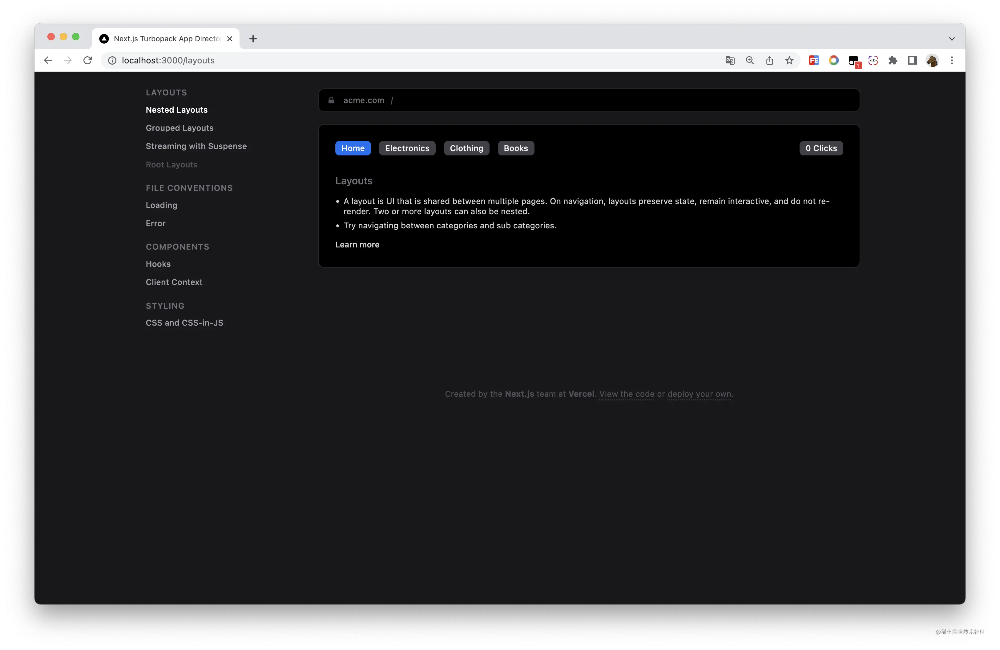

這是啟動後的界面，這個 demo 不是一個簡單的頁面，而是一個包含了深度嵌套路由的例子。

下圖我開發時的截圖，Turbopack 直接在命令行中打印出了構建時間，我們看到啟動時間只需要 2.3ms
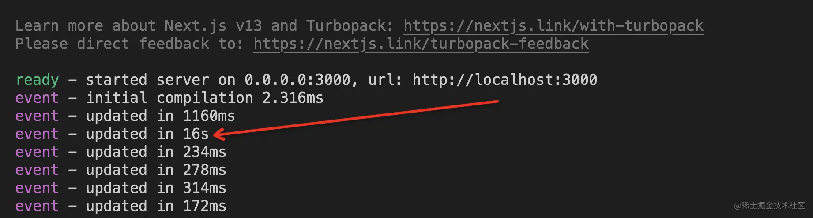

試著修改代碼，程序會自動熱更新，絕大多數次數更新時間都很快，但偶爾有幾次更新時間卻很長，圖片中有一處需要 16s（我使用的是 Mac M1)，這其中的原因就不得而知了，尤大也發布了測評，使用 1000 個節點來對比更新速度，數據顯示：根組件與 vite 時間幾乎相同，葉子節點比 vite 快 68%，與官方稱比 vite 快 10 倍相差甚遠。當然目前 Turbopack 還處於 alpha 階段，期待 Turbopack 能夠盡快推出正式版。

### Turbopack 特點

開箱即用 TypeScript, JSX, CSS, CSS Modules, WebAssembly 等
增量計算： Turbopack 是建立在 Turbo 之上的，Turbo 是基於 Rust 的開源、增量記憶化框架，除了可以緩存代碼，還可以緩存函數運行結果。
懶編譯：例如，如果訪問 localhost:3000，它將僅打包 pages/index.jsx，以及導入的模塊。

### 為什麽不選擇 Vite 和 Esbuild？
Vite 依賴於瀏覽器的原生 ES Modules 系統，不需要打包代碼，這種方法只需要轉換單個 JS 文件，響應更新很快，但是如果文件過多，這種方式會導致瀏覽器大量級聯網絡請求，會導致啟動時間相對較慢。所以作者選擇同 webpack 一樣方式，打包，但是使用了 Turbo 構建引擎，一個增量記憶化框架，永遠不會重覆相同的工作。
Esbuild 是一個非常快速的打包工具，但它並沒有做太多的緩存，也沒有 HMR（熱更新），所以在開發環境下不適用。

##　為什麽要改基於文件的路由系統
Next 13 另一個比較大的改動是基於文件的路由系統，增加了一個 app 目錄，每一層路由必須建一個文件夾，在該文件夾中建立 page.tsx 作為該路由主頁面
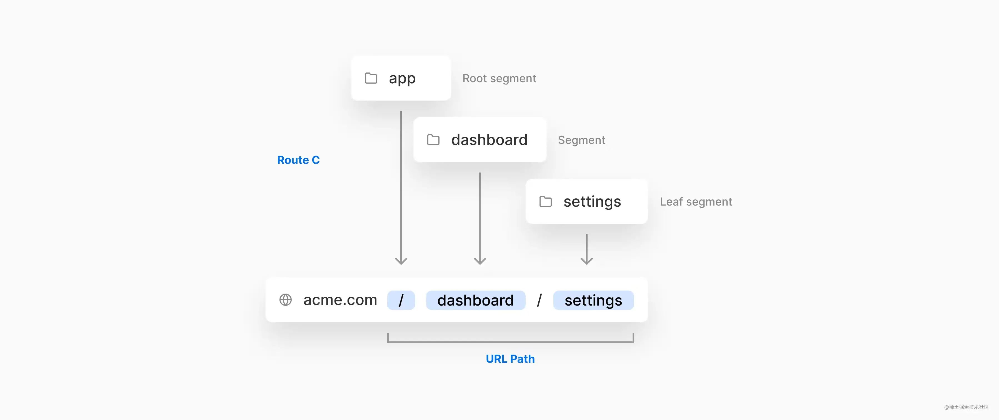
而在 Next.js 12（以及以下）對應的路由系統，是所有路由文件都寫在 pages 目錄下，每個文件都會生成一個路由，很明顯是這種方式更加簡潔。
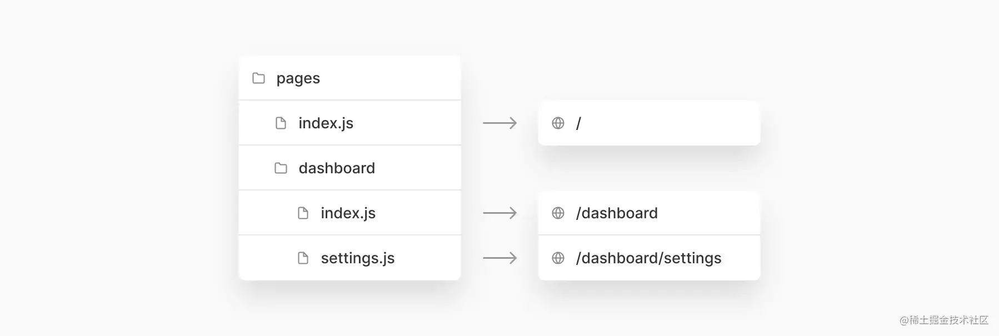
那麽，Next.js 為什麽要改基於文件的路由系統呢？
主要有以下 3 點原因:

實現嵌套路由和持久化緩存
支持 React 18 中的 React server Component，實現 Streaming（流渲染）
實現代碼目錄分組，將當前路由下的測試文件、組件、樣式文件友好地放在一起，避免全局查找

## Next.js 12 中 Layout 實現方式
Tailwindcss 的作者 Adam Wathan 早在 2019 年就寫過一篇博客，關於 Next.js 如何實現持久化緩存
-https://link.juejin.cn/?target=https%3A%2F%2Fadamwathan.me%2F2019%2F10%2F17%2Fpersistent-layout-patterns-in-nextjs%2F

其中有個demo能夠很好的說明 next.js 不能實現持久化緩存，大家可以在 codesandbox 中體驗。
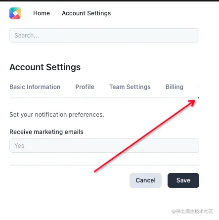

實現方式是每個 page 頁面直接引用 components 文件下的導航組件，當點擊橫向滾動條後面的導航頁面，會導致整個頁面都刷新，從而沒有記錄滾條的位置。
他解決辦法是，需要通過往 Page 頁面函數上添加靜態方法getLayout來實現，詳情代碼可以看這個例子。
-https://codesandbox.io/s/5-getlayout-function-on-page-and-layout-components-7e1bg?from-embed

```
// /pages/account-settings/basic-information.js
import SiteLayout from '../../components/SiteLayout'
import { getLayout } from '../../components/AccountSettingsLayout'

const AccountSettingsBasicInformation = () => <div>{/* ... */}</div>

AccountSettingsBasicInformation.getLayout = getLayout

export default AccountSettingsBasicInformation
```

比如上面例子中的賬戶設置—->基本信息頁面代碼，是在 Page 頁面中綁定 getLayout 靜態方法，getLayout 返回頁面的公共導航組件。

在 _app.tsx 中調用 getLayout 方法，從而區別各個頁面的 layout 布局不同。

```
import React from 'react'
import App from 'next/app'

class MyApp extends App {
  render() {
    const { Component, pageProps, router } = this.props
    const getLayout = Component.getLayout || (page => page)

    return getLayout(<Component {...pageProps}></Component>)
  }
}

export default MyApp
```

如果你也有之前的 Next 項目，也需要實現持久化緩存，可以參考這個例子。

## app 文件夾下的約定式路由

Next13 新增了 app 文件夾 來實現**約定式路由**，完美地實現了持久化緩存，以下是官方 with-turbopack 項目下部分頁面結構
```
./app
├── GlobalNav.tsx
├── layout.tsx
├── page.tsx
├── layouts
│   ├── CategoryNav.tsx
│   ├── [categorySlug]
│   │   ├── SubCategoryNav.tsx
│   │   ├── [subCategorySlug]
│   │   │   └── page.tsx
│   │   ├── layout.tsx
│   │   ├── page.tsx
│   │   └── template.tsx
│   ├── layout.tsx
│   ├── page.tsx
│   └── template.tsx
```
對應的頁面效果如下圖
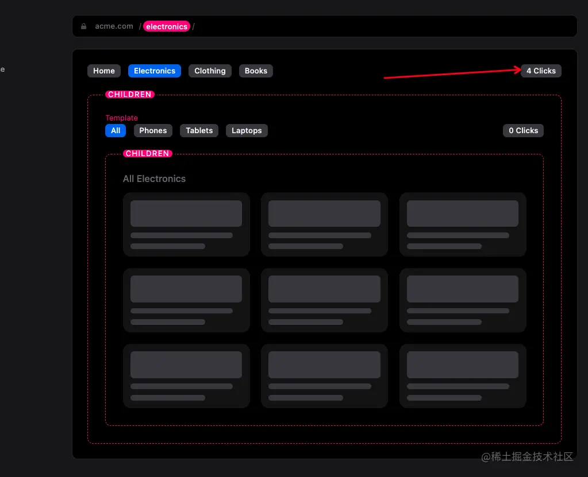

我們看到每個文件下都有 3 個文件 layout.tsx、page.tsx 、template.tsx、

layout.tsx 該路由下的公共導航，切換路由時，不會刷新，我們可以看箭頭處的 Count 組件，並沒有刷新
template.tsx 該路由下的公共部分，切換路由時，會刷新
page.tsx 該路由的主頁面

當我們點擊導航時候，頁面上刷新部分邊框會高亮閃爍，我們可以很好地理解代碼目錄結構組織與頁面呈現的路由和渲染。
在 app 目錄下每個文件夾下，還可以有 loading.tsx、error.tsx

loading.tsx 該路由的主頁面在異步渲染中，會顯示的 loading 組件的內容；例如我們可以用它來寫骨架屏（Skeleton）
error.tsx 該路由的頁面渲染出錯，會顯示該頁面，也就是封裝了 React 的 ErrorBoundary。

以上除了 page.tsx 其他文件都是可選的，除了這些約定名稱的文件外，我們可以建立任意文件，比如 components.tsx、 test.tsx 等自定義文件。app 目錄可以很好地將頁面、組件、測試文件放在一起，管理代碼目錄，避免開發時全局查找。

### 路由分組

app 同層級目錄下還支持多個 layout， 使用 （文件夾）區分，（文件夾）不會體現在路由上，只是單純用來做代碼分組。
```
./app
├── (checkout)
│   ├── checkout
│   │   └── page.tsx
│   ├── layout.tsx
│   └── template.tsx
├── (main)
│   ├── layout.tsx
│   ├── page.tsx
│   └── template.tsx
```

比如官方 playground 中關於電子商務的例子，main 和 checkout 的 layout 是不同的，可以根據實現功能自定義分組代碼目錄。
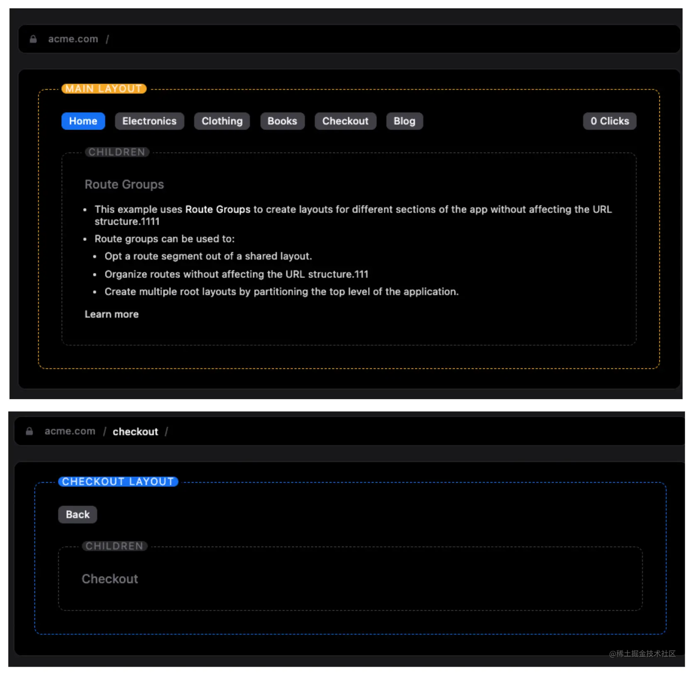


### React Server Components
在 app 目錄下的組件默認都是 **React Server Components**，那麽 React Server Components 有什麽優勢呢？
這里有幾個概念


CSR:所有前端打包到前端，通常會引起瀏覽器加載 JavaScript 過大，從而導致首屏白屏時間過長


SSR：數據在服務端請求，通過 renderToString 方法將字符串 DOM 結構輸出給瀏覽器，此時瀏覽器還不能交互，React 不能管理已經存在的 DOM，需要重新執行一遍，這個過程叫“注水”（Hydrate）。Next12 getServerSideProps 的渲染方式也就是 SSR。


SSR 解決了白屏時間過長的問題和 SEO 的問題，但也並不是完美的，過多的請求會導致服務端響應時間變長，“注水”（Hydrate）的過程也會導致客戶端代碼量的增加。
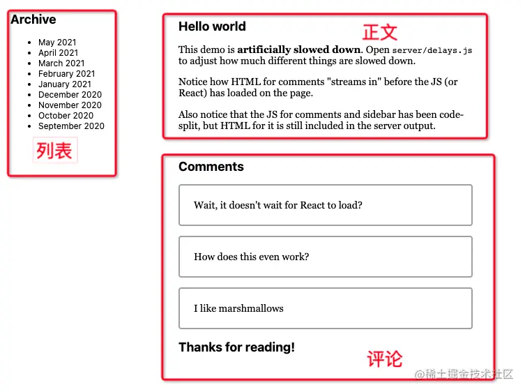

比如一個傳統的博客頁面采用 Next12 的方式使用```getServerSideProps``` 的方式渲染，那麽就需要等 3 個接口全部返回才可以看到頁面。
```
// 每次請求執行
export async function getServerSideProps() {
  const list = await getBlogList()
  const detail = await getBlogDetail()
  const comments = await getComments()

  // Pass data to the page via props
  return { props: { list,detail,comments } }
}
```

React Server Components ( RFC ) 與傳統的 SSR 不同，優點是擁有流式 HTML 和選擇性注水

React Suspense API 解鎖了 React 18 中的兩個主要 SSR 功能：


在服務器上流式傳輸 HTML。
要實現這個功能，需要從原來的方法切換renderToString切換到新renderToPipeableStream方法。


客戶端的選擇性注水作用。
使用 hydrateRoot 代替 createRoot 方法。


比如上面的博客實例，評論接口查詢速度較慢，就可以使用 Suspense 實現流渲染。

```
import { lazy } from 'react';
const Comments = lazy(() => import('./Comments.js'));
//...
return  (
  <Layout>
    <NavBar />
    <Sidebar />
    <RightPane>
      <Post />
      <Suspense fallback={<Spinner />}>
        <Comments />
      </Suspense>
    </RightPane>
  </Layout>
)
```
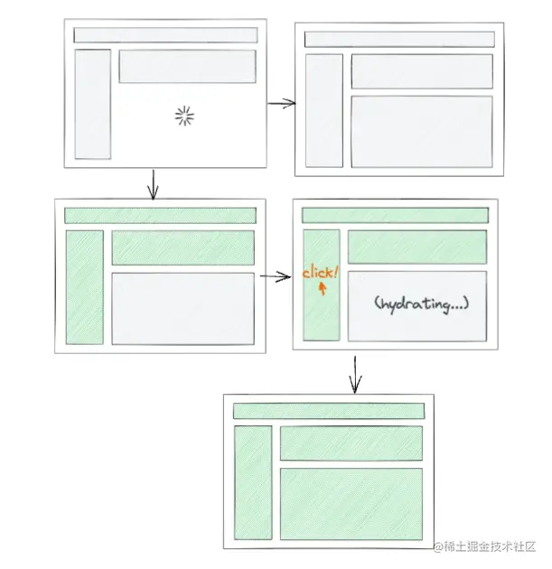
如圖所示

灰色部分代表 HTML 字符串返回
loading 狀態表示當前部分還在請求
綠色部分代表注水成功，頁面可以交互

所謂的流就是通過 script 動態返回最小 html，並且插入到正確的位置，頁面中如果有多個 Suspense，是沒有先後順序的，React Server Components 是並行的。
以上內容在《New Suspense SSR Architecture in React 18》 
- https://github.com/reactwg/react-18/discussions/37
中可以找到，而要搭建 react 流渲染的架構相對比較覆雜，大家可以看 gaearon dan 的 demo
- https://codesandbox.io/s/kind-sammet-j56ro?file=/src/App.js
，而 Next.js 13 只需要在 app 目錄下，按照約定的文件名稱寫，就可以自動實現 React Server Components。

### 實現流渲染
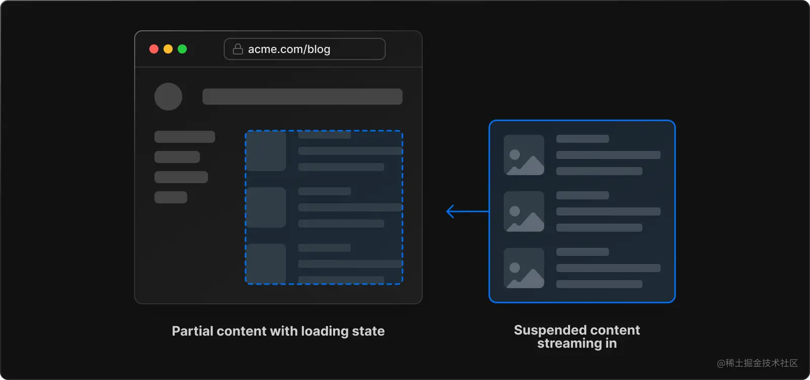
除了 app 目錄下嵌套路由部分 next.js 會幫我們默認采用 React Server Components，我們在 page 頁面中，也可以實現。
實現方式也很簡單，組件外層使用 ```Suspense```
```
import { SkeletonCard } from '@/ui/SkeletonCard';
import { Suspense } from 'react';
import Description from './description';

export default function Posts() {
  return (
    <section>
      <Suspense
        fallback={
          <div className="w-full h-40 ">
            <SkeletonCard isLoading={true} />
          </div>
        }
      >
        <Description />
      </Suspense>
    </section>
  );
}
```
組件數據請求使用 use API，就可以實現流渲染了。
```
import { use } from 'react';

async function fetchDescription(): Promise<string> {
  return fetch('http://www.example.com/api/data').then((res)=>res.text())
}

export default function Description() {
  let msg = use(fetchDescription());
  return (
    <section>
      <div>{msg}</div>
    </section>
  );
}
```
### 使用場景
從官方的 playground 中看，在一些請求較慢的接口，比如電商網站中的價格計算，若要使用服務端渲染，就可以使用 server Component。


### 服務端組件和客戶端組件
Next.js 最大的優勢就是我們只需要一個工程，就可以搞定前端工程和後端工程，哪些是前端代碼和哪些是後端代碼，Next.js 在打包的時候就會幫我們自動區分，這需要開發者清楚地理解，自己寫的代碼哪些是在服務端執行，哪些是在客戶端執行。

**Next12 區分**
我們知道 Page 函數都是在服務端執行的，包括 getServerSideProps、getStaticPaths、getStaticProps，那麽如果需要在客戶端執行有以下 2 種方式；

在 useEffect、 onChange 等回調函數中使用，比如下面例子，動態加載了 fuse.js，實現模糊搜索。

```
import { useState } from 'react'

const names = ['Tim', 'Joe', 'Bel', 'Lee']

export default function Page() {
  const [results, setResults] = useState()

  return (
    <div>
      <input
        type="text"
        placeholder="Search"
        onChange={async (e) => {
          const { value } = e.currentTarget
          // Dynamically load fuse.js
          const Fuse = (await import('fuse.js')).default
          const fuse = new Fuse(names)

          setResults(fuse.search(value))
        }}
      />
      <pre>Results: {JSON.stringify(results, null, 2)}</pre>
    </div>
  )
}
```
* 如果依賴了外部組件，或者 window 對象，可以使用 next/dynamic 並且設置 ssr 為 false
```
import dynamic from 'next/dynamic'

const DynamicHeader = dynamic(() => import('../components/header'), {
  ssr: false,
})
```

**Next13 區分**
在 Next13 中 ， 在 app 目錄下，如要使用 useState 等狀態管理的 hook，那麽該組件只在客戶端執行，需要在首行加入 'use client' 指令。

該區分服務端組件和客戶端組件，下表列出了常用使用場景
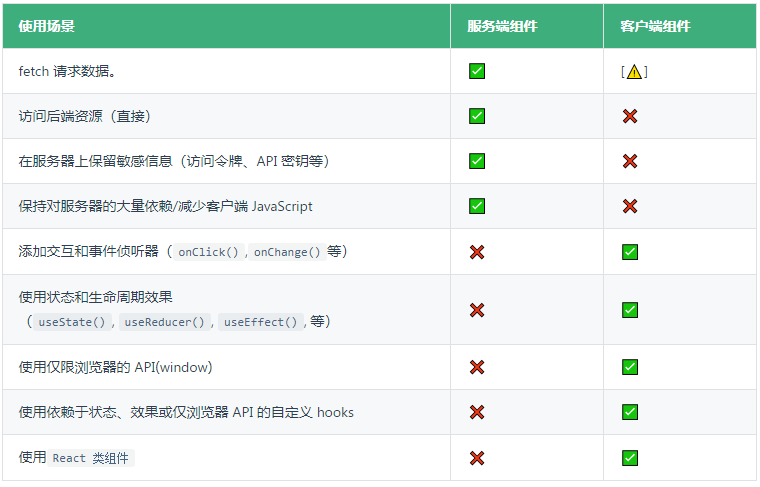

### 數據請求
使用 react 的 use 函數加 fetch API 來實現：靜態站點生成（SSG）、服務器端渲染（SSR）和增量靜態再生（ISR）

在 Page 頁面使用 fetch：
```
import { use } from 'react';

async function getData() {
  const res = await fetch('...');
  const name: string = await res.json();
  return name;
}

export default function Page() {
  // 支持的全類型的數據格式
  // 可以返回不用序列化的格式數據
  // 因此可以返回 Date, Map, Set, 等.
  const name = use(getData());

  return '...';
}
```

fetch 的緩存策略
```
// 請求被緩存
// 相當於 `getStaticProps`.
// `force-cache` 是默認值，可以省略
fetch(URL, { cache: 'force-cache' });

// 每次刷新都會重新請求.
// 相當於 `getServerSideProps`.
fetch(URL, { cache: 'no-store' });

// 請求被緩存10s，10s 重新生成
// 相當於 `getStaticProps` 加上 `revalidate` 參數.
fetch(URL, { next: { revalidate: 10 } });
```
使用這種方式的優點是，當請求數據的增加，打包後前端 JavaScript 的大小不會增加。


### 新的 next/image
我們知道在 Next.js 12 之前，使用 標簽，eslint 會有一個警告，提示我們必須使用 next/image 組件， 因為 next/image 幫我們做了幾點優化

自動優化圖片格式
自動縮放圖片大小
使用Intersection Observer API 實現懶加載

所以 image 必須加上 width 和 height 參數
新的 Next/image 使用了瀏覽器的 lazy-loading 代替了 Intersection Observer API
默認情況下需要 alt 標記，因此減少了客戶端 JavaScript 代碼，當然這個屬性對瀏覽器要求較高，要求 chrome 77+。

```
import Image from 'next/image';
import avatar from './lee.png';

function Home() {
  // 為了提高可訪問性 "alt" 屬性是必須的
  // 圖片可以使用放在 `app/`  目錄下
  return <Image alt="leeerob" src={avatar} placeholder="blur" />;
}
```

## @next/font
加入了一個新的包，可以在構建時直接引用 google 字體和本地字體，實現字體的托管和預加載，這點對英文網站很有用，中文網站一般不加載字體，圖標建議使用 svg。

加載谷歌字體

```
import { Inter } from '@next/font/google';
const inter = Inter();
<html className={inter.className}>
```

## next/link
* 自動加上 <a>標簽。

Next.js 12: 需要<a> 包裹
```
import Link from 'next/link'
<Link href="/about">
  <a>About</a>
</Link>
```
Next.js 13: <Link> 不需要 <a>
```
<Link href="/about">
  About
</Link>
```

## 小結
本文主要結合了 Next13 官網博客 摘取了部分內容，結合筆者對 Next.js 的理解和分析，介紹了其變動、使用方法，以及其改動原因， Next13 這次更新主要與 React server component 深度結合，在"用戶體驗、可維護性、性能"這幾個方面都帶來了巨大的提升，本以為 React 的 Server component 還遙不可及，但 Next13 卻讓我們觸手可及， Next13 也將成為升級 React18 的首選框架，未來前後端並行的開發模式或許能夠成為主流，這也將是對前端開發者的一個挑戰。
以上就是本文的全部內容，關於 Next13 你學會了嗎？


## source
- https://juejin.cn/post/7160084572942630926