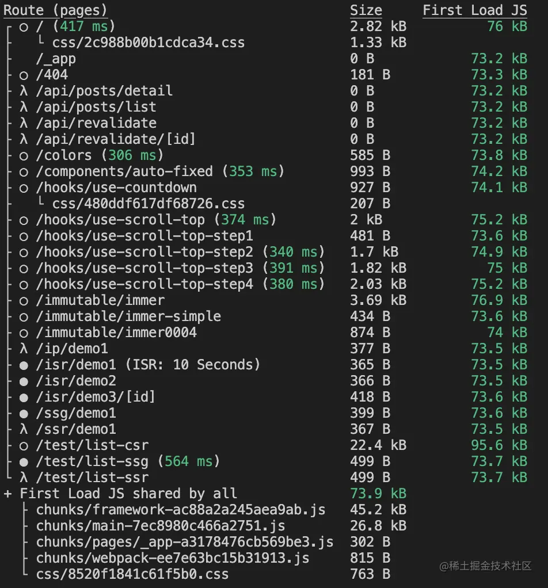
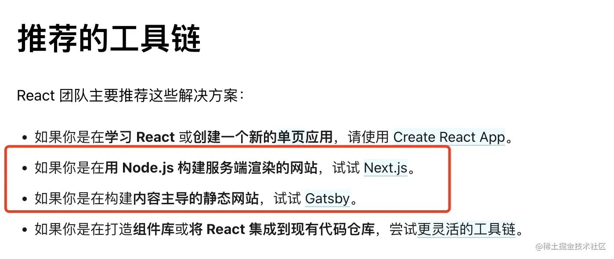

# 為何使用NEXT.js
-----
- NEXT 自稱生產環境的React
    - 實際上為React的全端框架
- 使建構大型React app更加方便
- 內含許多方法，減少為了解決問題而引入大量插件的問題。
- React是CSR，當獲取資料的時候，由於還沒有資料，User會看到loading的畫面，SEO也只會看到空的HTML。
    - React若想使用SSR，需要添加額外的語法。
# NEXT做了甚麼
1. 完善的工程化機制
2. 良好的開發和構建性能
3. 智能文件路由系統
4. 多種渲染模式來保證頁面性能體驗
5. 可擴展配置
6. 提供其他多方面性能優化方案
7. 提供性能數據，讓開發者更好的分析性能。
8. 提供的其他常用功能或者擴展，比如使用 mdx 來編寫頁面的功能等等。

## 完善的工程化機制

- 不需要自己去配置 webpack 方案，它已經內置了以下工程化基礎：
  - babel 內置，支持JS代碼向後兼容
  - postcss 內置，支持CSS代碼向後兼容
  - browserslist 支持配置兼容的瀏覽器信息，配合 babel 和 postcss 工作。
  - TypeScript 可選擇使用，保證代碼的質量，以及可閱讀性和可維護性。
  - eslint 可選擇使用，檢測代碼格式，可自定義規則。vscode 編寫代碼，或者build打包時都會有提示。
  - prettier 可通過擴展使用，格式化代碼，可自定義規則。
  - css modules 內置
  - css-in-js 可擴展使用
  - tailwind css 可擴展使用
  
- 也做了一些打包優化功能：
  - tree shaking
  - 代碼壓縮
  - 頁面自動靜態化
  - 按需打包第三方 es 包（通過設置 transpilePackages 屬性，讓部分包可以被 next-babel 打包）
  - 異步動態加載組件，和 React.lazy 功能一樣，只不過實現得更早。

基本上使用了 Next.js 你不需要再去處理工程化相關事項。也可以通過很簡單的方式去優化打包性能，且每次構建都會輸出頁面資源大小信息，如下圖所示：


- 良好的開發和構建性能
  - next.js 使用 turbopack 進行編譯打包(windows上可能有效能問題)

- 智能文件router系統
  - Next.js 的智能文件路由指的是，頁面寫在 pages 目錄或者 src/pages 下的 js 文件都會被認為是頁面，也會當成頁面來打包，路由定義了一套動態路由的規則，感興趣的可以去看一下。
  - 上面說的只要是特定目錄下的 js 文件都會當成頁面，這樣會造成不經意把非頁面的 js 文件也打包成了頁面，這樣肯定是不太好的，因此 Next.js 13 才會推廣出 app 目錄下的新模式，但還不太穩定，有些功能還沒實現，因此如果在老模式下還是需要注意，可以這樣來處理文件結構：
  ```
    ./src
    ├── common // 公共部分
    ├── views // 頁面內容，所有代碼都寫在這個文件
    │   └── home // 首頁
    │       ├── index.tsx
    │       ├── List.tsx
    │       ├── util.ts
    │       └── style.module.css
    ├── pages
    │   ├── _app.tsx
    │   ├── _document.tsx
    │   ├── api
    │   └── home.tsx // 只對 src/views/home 的導出進行轉發
    └── styles
        ├── Home.module.css
        └── globals.css
    ```

  - pages/** 目錄下只對 src/views/** 的export進行轉發。
    ```
    // src/pages/home.tsx
    export * from "../views/home";
    ```
- 多種渲染模式來保證頁面性能體驗
    - 理解前端基礎渲染模式｜CSR、SSR、同構、靜態化
        - https://juejin.cn/post/7204085076504920119
    - 前端各種渲染模式性能對比分析｜讓頁面在3G網速還能1s打開
        - https://juejin.cn/post/7205875448575262776
    - Next.js性能優化之ISR渲染入門和原理探索
        - https://juejin.cn/post/7199812069050171452

- 可擴展配置
Next.js 的可配置性真的是一個很強大的特色，它準備了一套默認就很好用的默認配置，但這些配置基本上用戶都可以 *完全* 控制它（完全做一個保留，但大型工程基本上都是可以支撐的）。
下面我們來分析一下它的可配置功能。

  - 配置文件 next.config.js 中暴露了 webpack 實例，因此你可以完全控制 webpack
  - 配置文件 next.config.js 中支持配置自定義配置，你可以把一些公用的不變的配置寫在 serverRuntimeConfig 或者 publicRuntimeConfig 中，前者只會出現在服務端，後者會暴露到客戶端。
  - 可 自定義 server ，你可以在啟動服務的時候做一些自己想要做的處理，比如 node.js 性能監控等等。
  - 不自定義 server ，也可以使用它提供的 middreware 機制來攔截請求或者校驗權限等事項。
  - 自定義 APP，也就是 _app.js，它用於處理多個頁面公共部分。
  - 自定義 Document，也就是_document.js，用於自定義配置 html 生成內容，比如插入 Google 分析腳本。
  - 自定義錯誤界面 也就是 404 或者 500 錯誤狀態的頁面。
  - 自定義頁面 head 屬性，使用
  - next/head 提供的 Head 組件，用於自定義 html document 頭部的 title/meta/base 等標簽信息。
  - 可自定義 babel 和 postcss 等工程化規則配置。

- 提供其他多方面性能優化方案
Next.js 除了頁面默認靜態化（不使用getServerSideProps/getStaticPath/getInitialProps），還提供了其他方面的優化方案：
  - 圖片優化：大部分頁面基本上都會有或多或少的圖片，圖片往往是影響頁面性能體驗的重要因素之一，因為現在一張圖片的體積很可能比頁面的所有代碼容量還大，因此關注性能就一定要關注圖片。
  - 字體優化：字體文件一般也比較大，這一塊還不是很了解，因為時間問題，後續了解完再更新一下。

- 提供性能數據
  - Next.js 提供了获取应用性能数据的方法 reportWebVitals, 只能在 App 组件中使用。
  ```
    // _app.tsx
    export function reportWebVitals(metric: NextWebVitalsMetric) {
    console.log(metric)
    }
  ```
- 提供的其他常用功能或擴展:
  - 其他功能：
  API Routes ，Next.js 支持在 pages/api 目錄下編寫接口，可通過接口去實現 ISR 增量靜態化功能，前端用於編寫 BFF 接口應該也是一個不錯的方案，但注意不能在 getStaticProps/getStaticPaths 中去請求，打包的時候請求不了。
  next/amp: 用於支持開發 AMP 應用。

  - 擴展：
  @next/mdx: 用於支持使用 mdx 來編寫頁面，也就是如果要開發一個 md 的文檔工程，直接接入它即可。

- 談談 React 單頁應用
  -  React 官方文檔現在也在推薦其他的搭建方案，比如 Next.js 和 Gatsby：
  
  - 其實 CRA 放棄沒放棄，關系也不是特別大，反正也可以暴露了 webpack 配置，但需要自己定制的內容太多，而且並沒不能完全的去體現出 React 的能力，比如不支持服務端渲染，也不支持 React 18 中的 Serevr Component/Client Component/Shared Component 等等新概念，因此 CRA 還是會逐漸被 Next.js 或者Gatsby.js 給逐漸取代，不過 Next.js 比 Gatsby.js 的擴展性更好，基本上 Gatsby.js 可以做的，Next.js 都可以做，反過來卻不行。
  - CAR 的結果如此，後續的前端開發的方向應該會更偏向 Next.js ，不過這些主要是在C端或者B工程的市場會表現更好，在不那麽重視首屏性能的管理端應用來說，影響不會那麽大。

## Reference
- https://juejin.cn/post/7206261082452639802