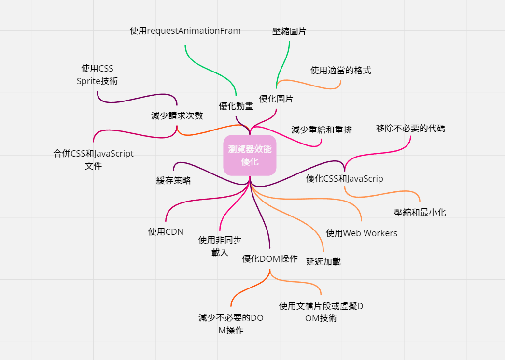

# 瀏覽器效能優化

-   減少請求次數：合併 CSS 和 JavaScript 文件，使用 CSS Sprite 技術，以減少 HTTP 請求的次數。
-   使用 CDN：使用內容分發網絡（CDN）來加速靜態資源的傳輸。
-   優化圖片：壓縮圖片、使用適當的格式（例如 WebP）和尺寸。
-   延遲加載：使用懶加載技術來延遲非必要資源的加載。
-   緩存策略：設定 HTTP 緩存頭，使瀏覽器可以重用先前下載的資源。
-   優化 CSS 和 JavaScript：壓縮和最小化 CSS 和 JavaScript 文件，移除不必要的代碼。
-   使用非同步載入：非同步加載 JavaScript，以避免阻塞頁面渲染。
-   優化 DOM 操作：減少不必要的 DOM 操作，使用文檔片段或虛擬 DOM 技術。
-   使用 Web Workers：將複雜的計算移到背景執行緒，以避免阻塞主執行緒。
-   優化動畫：使用 requestAnimationFrame 來進行動畫，而不是 setTimeout 或 setInterval。
-   減少重繪和重排：避免頻繁的 DOM 和 CSS 變更，以減少瀏覽器的重繪和重排次數。

