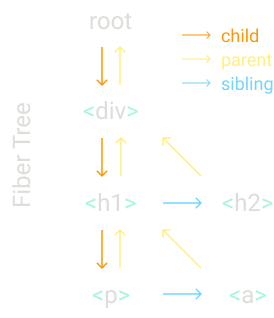
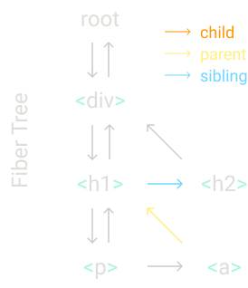

# Review

```js
const element = <h1 title="foo">Hello</h1>;
const container = document.getElementById('root');
ReactDOM.render(element, container);
```

JSX => JS 的過程是透過 Babel 之類的工具進行編譯，將其透過 createElement 的 method 進行轉換。
createElement 中包含 3 個參數，分別是標籤名稱( type )、屬性( props )、子元素( children )。

-   標籤名稱 : 我們希望建立的標籤名稱。
-   屬性 : 標籤上包含的屬性。
-   子元素 : 標籤中的內容。

Babel 流程 :

```jsx
<div className="example"> Hello World !</div>

<div className="example">Hello World!<span>123</span></div>
```

<!-- transformed -->

```js
React.createElement('div', { className: 'example' }, 'Hello World!');

React.createElement(
    'div',
    { className: 'example' },
    'Hello World!',
    React.createElement('span', null, '123')
);
```

<!-- Browser Rending -->

```js
// transformed from Babel ( createElement )
const element = {
    type: 'h1', //select Node ( DOM )
    props: {
        //assign element( react element ) props
        title: 'foo',
        children: 'Hello',
    },
};
// get DOM
const container = document.getElementById('root');

//rendering
ReactDom.render(element, container);

// ReactDOM render function
const node = document.createElement(element.type);
node['title'] = element.props.title;

const text = document.createTextNode('');
text['nodeValue'] = element.props.children;

// nodeValue = children.value

node.appendChild(text);
container.appendChild(node);
```

總結 :
透過這部分可以了解 jsx 是如何被轉換為 js ，以及 React.createElement 所產生的 result 是甚麼，還有 ReactDOM.render 做了甚麼。

# The createElement Function

在前面知道了 createElement 做甚麼之後，這部分將建立自己的 createElement。
首先我們知道 element 是一個包含 type & props 的物件，並且 children 可能會是一個複數的資料，這邊可以透過 array 進行儲存。

```js
function createElement(type,props,...children){
    return {
        type,
        props{
            ...props,
            children
        },
    }
}

// children example
{
  "type": "div",
  "props": { "children": [a, b] }
}
```

這邊我們也知道 children 有可能是 primitive values( string | number) | element，如果是 primitive values 就需要調用 createTextElement 將其放入 nodeValue 中。
並且為他們建立一個新的 type，

```js
function createElement(type,props,...children){
    return {
        type,
        props{
            ...props,
            children : children.map(child=>
                typeof child === "object"
                ? child
                : createTextElement(child)
            )
        },
    }
}


function createTextElement(text) {
  return {
    type: "TEXT_ELEMENT",
    props: {
      nodeValue: text,
      children: [], //這邊為了保持數據結構 但不是必要的
    },
  }
}
```

接下來我們需要建立一個 library 來儲存這個 createElement。

```js
const MyReact = {
    createElement,
};
```

接下來就可以透過這個 createElement 進行實作

```js
const element = MyReact.createElement(
    'div',
    { id: 'foo' },
    MyReact.createElement('a', null, 'bar'),
    MyReact.createElement('b')
);
```

<!-- transformed -->
### 只要有加上 /**@jsx MyReact.createElement **/ 這段 babel 在編譯的時候會優先使用我們自訂的 createElement

```js
/**@jsx MyReact.createElement */
const element = (
    <div id="foo">
        <a>bar</a>
        <b />
    </div>
);

const container = document.getElementById('root');
```

總結 :
透過實作 createElement，可以深入了解 React 是如何：

解析 JSX：在 React 中使用 JSX，Babel 會將其轉換成 React.createElement 的調用。透過自己實作這個函數，你可以了解 JSX 是如何被解析和轉換成 JavaScript 對象的。

建立虛擬 DOM：createElement 返回的對象代表虛擬 DOM 的一個節點。虛擬 DOM 是 React 的核心概念，它是一個 JavaScript 對象樹，代表了真實 DOM 的結構。透過實作，你可以了解虛擬 DOM 的結構和工作原理。

處理子元素：在 createElement 函數中，子元素可以是元素、文本或其他組件。這顯示了 React 的組件模型是如何允許嵌套和組合的。

區分文本和元素節點：createTextElement 函數用於創建文本節點。這顯示了 React 是如何區分文本和元素節點的，並對它們進行不同的處理。

建立一致的數據結構：無論是元素還是文本，createElement 和 createTextElement 都返回具有類似結構的對象（具有 type 和 props 屬性）。這種一致性使得後續的渲染和更新邏輯更加簡單和高效。

# The render Function

render function 主要的作用是在於進行將 element 加入 DOM，以及更新畫面 & 刪除 element。
這邊處理 add 的部分。

```js
function render(element, container) {
    //create dom nodes
}

const MyReact = {
    createElement,
    render,
};
```

```js
/**@jsx MyReact.createElement */
const element = (
    <div id="foo">
        <a>bar</a>
        <b />
    </div>
);

const container = document.getElementById('root');
MyReact.render(element, container); // add this
```

新增 element

```js
function render(element, container) {
    //  const dom = document.createElement(element.type);
    //  如果 type 是前面建立的 TEXT_ELEMENT 表示這是一個 文字 node，所以需要建立一個文字 node
    //  建立虛擬 DOM
    const dom =
        element.type == 'TEXT_ELEMENT'
            ? document.createTextNode('')
            : document.createElement(element.type);

    //一個用於確定給定的鍵是否不是 'children'的判斷函數。這是因為我們只想將非 children 的屬性設定到 DOM 節點上。
    const isProperty = (key = key !== 'children'); //設定屬性條件

    object
        .keys(element.props)
        .filter(isProperty) // (key = key !== 'children')
        .forEach(name => {
            dom[name] = element.props[name];
        });

    element.props.children.forEach(child => render(child, dom)); // recursive child node
    container.appendChild(dom); //add virtual DOM to container
}
```

現在 render function 可以進行新增 node 的操作

# Concurrent Mode ( 併發模式 )

## re-factory before next step

現在的問題在於 只要開始進行 render 在結束前就不會停止，可以發現問題在於 recursive 的部分。
解決方案 :
拆解工作區塊，讓額外進程可以在各區塊的中間執行。
實現增量渲染，允許 React 在長時間的渲染任務中進行中斷，從而確保瀏覽器仍然響應。( React Fiber 架構的核心概念 )。
實際上就是在每個工作區快結束時，執行 requestIdleCallback 確認主進程是否閒置，是的話就繼續執行。

```js
//
let  nextUnitOfWork = null
// 1. Traverse all virtual DOM from root ,construct fiber tree
function workLoop(deadline) {
    // 2. loop Traverse Fiber tree ,construct DOM tree
  let shouldYield = false //是否讓 browser 執行其他任務
  while (nextUnitOfWork && !shouldYield) {
    nextUnitOfWork = performUnitOfWork(nextUnitOfWork) //執行完一個 工作區塊後 回傳下一個工作區塊
    shouldYield = deadline.timeRemaining() < 1 // time left < 1ms 確認是否有其他進程 沒有就繼續執行工作區塊
  }
  // 3. submit DOM tree
  // when main work Idle , run workLoop
  requestIdleCallback(workLoop)
}
​
requestIdleCallback(workLoop)
​
//用於處理當前的工作區塊，並返回下一個工作區塊
function performUnitOfWork(nextUnitOfWork) {
  // TODO
}
```

**requestIdleCallback** - idle = 閒置
允許你在主線程空閒時安排背景工作。這是一種優化性能的方法，特別是當需要執行一些不是立即必要的工作時。
類似於 setTimeout 不過等待時間為 當主進程的閒置時。

空閒時間執行：當瀏覽器完成了所有的緊急任務（如事件處理、渲染等）後，它會查看是否有任何空閒時間。在這些空閒時間段中，requestIdleCallback 被調用的函數會被執行。

優化性能：這允許瀏覽器在不影響主線程和用戶體驗的情況下，有效地利用其計算能力。

帶有截止時間的回調：當你的回調函數被調用時，它會接收一個參數，通常被稱為 deadline。這個 deadline 對象有一個 timeRemaining() 方法，它返回回調函數還有多少時間可以執行，這可以幫助你決定是否繼續當前的工作或將其推遲到下一個空閒周期。

取消回調：如果你決定不再需要執行某個回調，你可以使用 cancelIdleCallback 函數來取消它。

當 Idle 的時候，requestIdleCallback 會調用其中的 callback function 並且傳入一個參數 IdleDeadline ，通常命名為 deadline。

-   timeRemaining()：這是一個方法，返回一個表示當前帧還剩多少時間可以用於執行背景工作的數值（以毫秒為單位）。這允許你的代碼根據剩餘時間來決定是否繼續當前的工作或將其推遲到下一個空閒周期。

-   didTimeout：這是一個布爾值，表示是否已經超時。如果在調用 requestIdleCallback 時提供了一個超時選項，並且超時時間已過，那麼 didTimeout 會被設置為 true。

# Fibers

data structure : fiber tree
如果需要 render 以下資料結構

```js
MyReact.render(
    <div>
        <h1>
            <p />
            <a />
        </h1>
        <h2 />
    </div>,
    container
);
```



在 render function 中，我們將創建 root fiber & 把它放進 nextUnitOfWork，其餘的工作將被放進 performUnitWork，我們需要為所有的 fiber 元素做 3 件事情。

1. 將 element 加入 DOM
2. 為 element 的子元素建立 fibers
3. 選擇下一個工作區域

Traverse 方式 :
目標 Fiber 完成後，會先看是否有 children ，沒有的話就會找同位階的 element ，如果沒有就會去找父層的同位 element。

1. 檢查是否有子 Fiber（children）：如果有，則開始處理第一個子 Fiber。
2. 檢查兄弟 Fiber：如果目標 Fiber 沒有子 Fiber，但有兄弟 Fiber，則移動到兄弟 Fiber 並開始處理。
3. 回到父 Fiber：如果目標 Fiber 沒有子 Fiber 也沒有兄弟 Fiber，則回到其父 Fiber，並從父 Fiber 的兄弟 Fiber 繼續遍歷，直到找到下一個要處理的 Fiber。
   

接下來更新 render function

<!-- Origin -->

```js
function render(element, container) {
  const dom =
    element.type == "TEXT_ELEMENT"
      ? document.createTextNode("")
      : document.createElement(element.type)
​
  const isProperty = key => key !== "children"
  Object.keys(element.props)
    .filter(isProperty)
    .forEach(name => {
      dom[name] = element.props[name]
    })
​
  element.props.children.forEach(child =>
    render(child, dom)
  )
​
  container.appendChild(dom)
}
```

<!-- New Ver -->

抽出建立 DOM 的邏輯

```js
function createDom(fiber) {
  const dom =
    fiber.type == "TEXT_ELEMENT"
      ? document.createTextNode("")
      : document.createElement(fiber.type)
​
  const isProperty = key => key !== "children"
  Object.keys(fiber.props)
    .filter(isProperty)
    .forEach(name => {
      dom[name] = fiber.props[name]
    })
​
  return dom
}


function render(element, container) {
  // TODO set next unit of work
   nextUnitOfWork = {
    dom: container,
    props: {
      children: [element],
    },
  }
}

// New ver
function performUnitWork(fiber){
  // 若 dom 是空的 在 fiber 中的 dom 位置建立並加入 fiber
    if (!fiber.dom) {
        fiber.dom = createDom(fiber)
    }
    ​  //在 fiber 的父層加入 fiber
    if (fiber.parent) {
        fiber.parent.dom.appendChild(fiber.dom)
    }

    // create new fibers
    let index = 0
    let prevSibling = null    const elements = fiber.props.children

    ​
    while (index < elements.length) {
    const element = elements[index]
    ​
    const newFiber = {
        type: element.type,
        props: element.props,
        parent: fiber,
        dom: null,
    }
    // 把剛建立的 element 加入倒 fiber tree 中，作為子 / 平級元素，根據是否為第一個 child
    if (index === 0) {
      fiber.child = newFiber
    } else {
      prevSibling.sibling = newFiber
    }
​
    prevSibling = newFiber
    index++

  }

    //根據前面提到的遍歷邏輯 進行尋找下一個工作區塊
   // TODO return next unit of work
    if (fiber.child) {
        return fiber.child
    }
    let nextFiber = fiber
    while (nextFiber) {
        if (nextFiber.sibling) {
            return nextFiber.sibling
        }
        nextFiber = nextFiber.parent
    }

}
```

<!-- New workLoop -->

```js
function workLoop(deadline) {
    let shouldYield = false;
    while (nextUnitOfWork && !shouldYield) {
        nextUnitOfWork = performUnitOfWork(nextUnitOfWork); //update here
        shouldYield = deadline.timeRemaining() < 1; //update here
    }
    requestIdleCallback(workLoop);
}
```

總結 :

-   Fiber 是 React 16 中引入的新的資料結構，用於追踪 component 的變更。
-   Fiber Tree 是一個表示 React 應用的樹狀結構，每個節點都是一個 Fiber。
-   在 render 函數中，我們會創建 root fiber 並將其放入 nextUnitOfWork。
-   performUnitWork 函數會對每個 fiber 執行三個主要任務：
    -   將 element 加入 DOM。
    -   為 element 的子元素建立 fibers。
    -   選擇下一個工作區域。
-   Fiber 的遍歷方式是：
    -   先檢查是否有子 Fiber。
    -   如果沒有子 Fiber，則檢查是否有兄弟 Fiber。
    -   如果既沒有子 Fiber 也沒有兄弟 Fiber，則回到其父 Fiber 並繼續遍歷。
-   performUnitWork 函數現在會為每個 fiber 建立 DOM，並將其加入到父 fiber 的 DOM 中。
-   新 fibers 會根據其在 props.children 中的位置被建立為子 fiber 或 Sibling fiber。
-   workLoop 函數會持續執行 performUnitOfWork 直到所有的工作都完成或達到 deadline。

# 


# Reference
https://pomb.us/build-your-own-react/ - Rodrigo Pombo