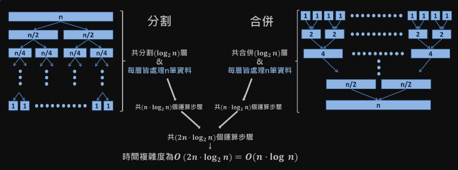

# sorting-algorithms( 排列演算法 )

-   Js 中可以使用 sort 進行排列
-   Java / Python ... 等等，都有內建 Sorting function

## Bubble Sort ( 冒泡排序 )

-   adjacent ( 比較 ) 相鄰的兩個元素，並且根據比較的結果進行互換。

```js
let temp = [5, 1, 2, 6, 8, 4, 3, 7];
```

比較 5 & 1 順序不對就交換，接下來比較 5 & 2 ...以此類推，重複直到排序完成。
pseudo code

```js
// 使用 Loop
// 使用兩個指針 一個指向第一個元素 另一個指向他的下一個元素
for i from 0 to A.length - 2 (inclusive):
    for i from A.length -1 (inclusive):
        if A[j] < A[ j-1 ]:
            exchange A[j] with A[j-1];
```

Todo :

```js
const bubbleSort = arr => {
    for (let i = 0; i <= arr.length - 2; i++) {
        for (let j = arr.length - 1; j >= i + 1; j--) {
            if (arr[j] < arr[j - 1]) {
                let temp = arr[j];
                arr[j] = arr[j - 1];
                arr[j - 1] = temp;
            }
        }
    }
};

let test = [];
for (let i = 0; i < 100; i++) {
    test.push(Math.floor(Math.random() * 100));
}

bubble(test);
```

## Insertion Sort ( 插入排序 )

-   將第一個元素視為一個長度唯一的已排序 Array ，將後續的元素根據他應該在的位置 插入該 Array 。
-   透過不斷循環插入進行排序。

### 複雜度

big O : n _ n
Omega : n
theta : n _ n

### pseudo code

```js
for i from index 1 to A.length - 1 ( inclusive )
    key = A[j];
    // Now, insertion key into the sorted sequence A[0,1,2,3,4,5,...,j-1]
    i = j-1
    while i >=0 and A[i]>Key:
        A[i+1] = A[i]
        i = i-1
        A[i+1] = key
```

### todo

思路 :
從第二個元素開始 與第一個元素進行比較 如果比第一個元素小 則插入第一個元素前面
以此類推 直到最後一個元素

```js
const InsertionSort = arr => {
    for (let i = 1; i < arr.length; i++) {
        let j = i - 1;
        let temp = arr[i];
        while (j >= 0 && arr[j] > temp) {
            arr[j + 1] = arr[j];
            j--;
        }
        arr[j + 1] = temp;
    }
    return arr;
};

// let temp = [];
// for (let i = 1; i < 20; i++) {
//     temp.push(Math.floor(Math.random() * 50));
// }
// console.log(InsertionSort(temp));
```

## Selection Sort ( 選擇排序 )

-   使用一個變數儲存未排序 array 中的最小值，並移動至最左邊。

### 複雜度

big O : O(n \* n)

### principle

-   不斷的去尋找最小值並且與最左邊的未排序 array 元素交換位置

### How to find smallest Value

-   use for ... loop

### pseudo code

```js
for i from 0 to A.length -2 :
    minIndex = i ;
    for j from i to A.length-1:
        if A[j] < A[minIndex]:
            minIndex = j
    swap A[minIndex] and A [i]
```

### todo

```js
const selectionSort = arr => {
    for (let i = 0; i <= arr.length - 2; i++) {
        let minIndex = i;
        for (let j = i; j <= arr.length - 1; j++) {
            if (arr[j] < arr[minIndex]) {
                minIndex = j;
            }
        }
    }
    // swap arr[minIndex] and arr[i]
    let temp = arr[minIndex];
    arr[minIndex] = arr[i];
    arr[i] = temp;
};
```

<!-- 相對複雜 -->

## Merge Sort ( 合併排序 )

-   divide and conquer ( 分而治之 )
-   將需要排序的 array 分割 在合併的時候 透過 pointer 比對兩個 array 的元素 比較小的放入新的 array 。
-   

## pseudo code

思路 :
先設定 result 用於儲存最後合併後的結果
當 i 小於 a1 的長度 或是 j 小於 a2 的長度 結束迴圈

merge

```js
merge(a1,a2)
    result = [], i=0,j=0;
    while i<a1.length and j< a2.length
        if a1[i] > a2[j]:
            add a2[j] to result
            j++
        else:
            add a1[j] to result
            i++
    //either arr1 or arr1 will have sth left
    // use loop to put all remaining things into the result
```

merge sort

```js
mergeSort(a) :
    if a.length equal to 1:
        return a
    else :
        middle = a.length / 2
        left = a.slice(0,middle)
        right = a.slice(middle, a.length)
        return merge(mergeSort(right),mergeSort(left))
```
