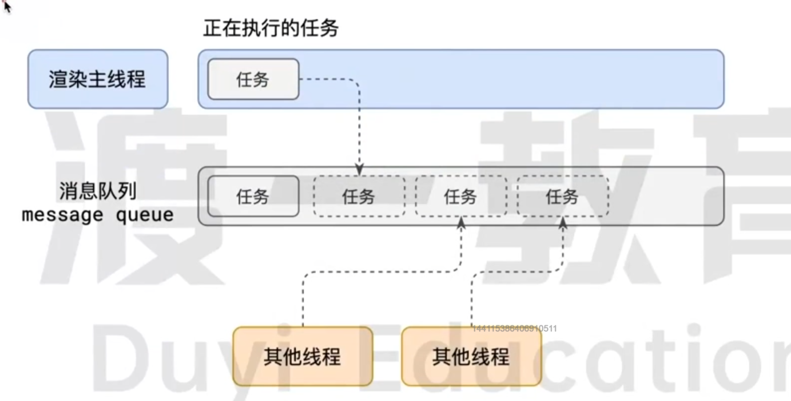
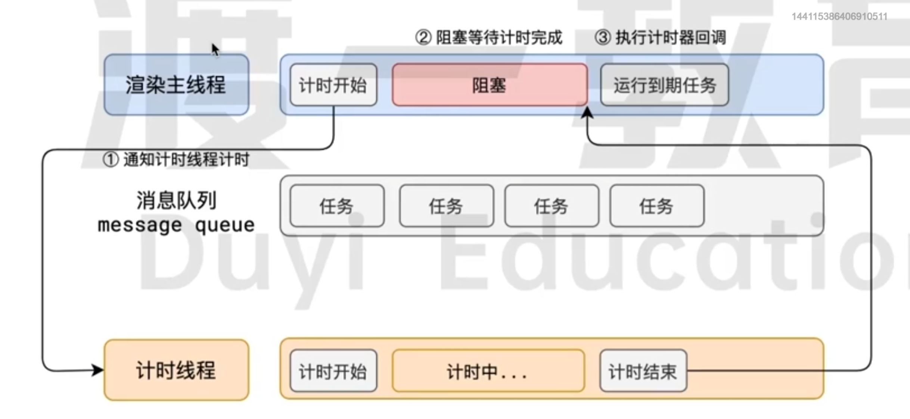
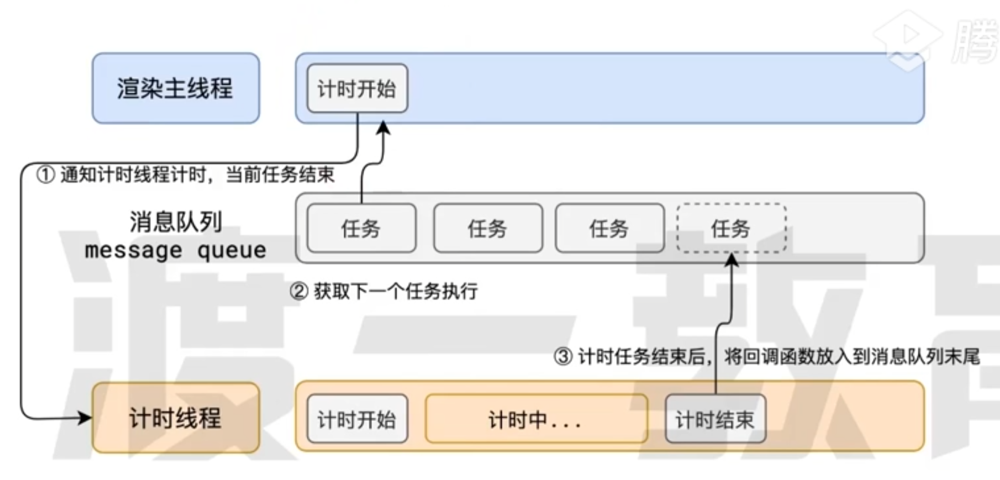
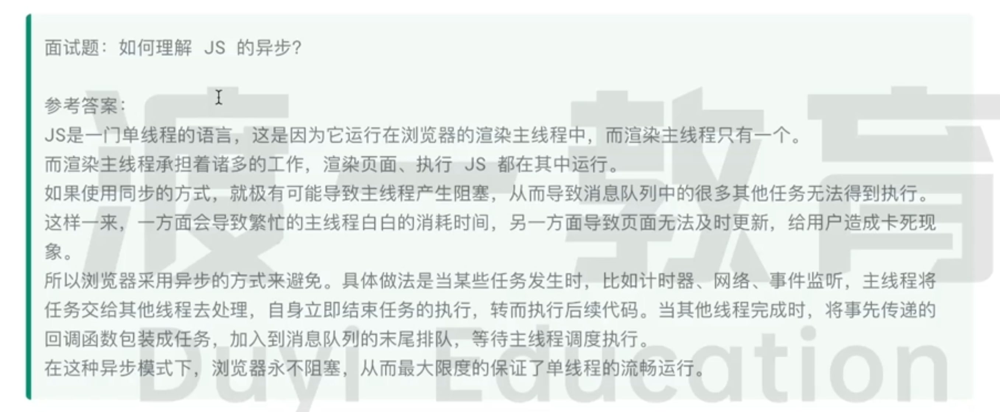
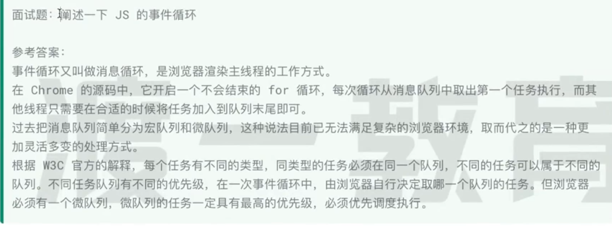
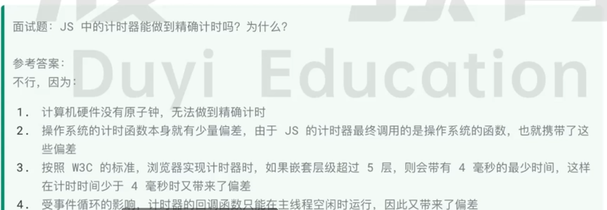

# 事件循環 & process / thread
- 事件循環是非同步的實現方式
- 單執行緒是非同步產生的原因

## 程序 & 執行緒（process and thread）
 一個程序至少需要有一個執行緒，所以當程序開啟時，會自動建立一個執行緒作為主執行緒使用，程序中可以包含多執行緒。

###  process （進程、程序、處理序、行程）
程式執行時所占用的記憶體空間，每個程式所占用的記憶體不會重疊，若想存取另一個程式中的資料，需要兩個程式都有接口。

### thread （線程、執行緒）
```
程序
|-- 主執行緒
|-- XX 執行緒
|-- OO 執行緒
```

## browser 中的 process and thread
browser 是一個 multi-process & multi-thread 的 application。
當 browser 啟動的時候，為了減少連緒崩潰的機率，會自動開啟多個處理 & 執行緒。

```
browser
|-- browser process 
    負責界面展示(導航列 ...等 browser 原生的界面)
    開啟其他執行緒
|-- internet process (Network service)
    處裡網路通信 & 網路資源的 loading
|-- render process ( tag page )
    會開啟一個主執行緒用來處理 ( HTML CSS JS )
    默認情況下，browser 會為每個 tag 開啟一個新的 render process 確保標籤頁的獨立性。
    (可能會改)
|-- ....
```

## render process - main thread
事件循環發生的位置。
- 需要做以下的事情
- 解析 HTML
- 解析 CSS
- 計算樣式
-  layout 
- 處裡圖層
- 每秒刷新畫面60次
- 執行全局 Js 
- 執行事件處裡函數
- 執行計數器的 callback
- ...

### render process 如何調派任務
ex:
- Js 進行中 user 點了一個 button，這時候該立即執行 button 的事件嗎 ?
  - 不會 會等其他 task 結束後才執行
- Js 進行中 有個計時器的時間到了 該立刻執行這個計時器的 callback 嗎 ?
- 或是當上面兩種狀況同時發生的時候該如何處裡

#### 透過排隊的方式解決以上問題 - message queue
遇到任務就丟進 message queue 中排隊

```
render main process
|-- task
    |-- message queue
        |-- task
        |-- task
        |-- task
        |-- task
        
```


#### message queue 的運作方式 === event loop
1. render process 會一直循環檢查 message queue
2. 每次循環的時候檢查 message queue 中是否有 task 有的話就從第一個開始執行，直到 task 處裡完畢，進入睡眠模式。
3. 所有 thread 可以一直新增 task 到 message queue 中的最末端，當添加 task 的時候， main thread 處於睡眠模式的話，就喚醒他並且繼續循環。

- event loop === message loop
    - 不斷去取出待處裡的 task 。

###  render process 不適用於多執行緒
1. 單執行緒界面：
瀏覽器的用戶界面通常是單執行緒的。這意味著用戶界面的更新、事件處理和渲染必須在同一個執行緒上進行，以避免競態條件和同步問題。

2. JavaScript 的單執行緒特性：
JavaScript，作為網頁的主要編程語言，是單執行緒的。這意味著在任何給定時刻，只有一段JavaScript代碼在執行。雖然有一些技術（如 Web Workers）可以在背景中進行一些並行處理，但UI渲染和大多數JavaScript代碼的執行仍然是單執行緒的。

3. 渲染過程的複雜性：
網頁渲染是一個複雜的過程，涉及到DOM樹的構建、CSS樣式的計算、布局計算和最終的像素渲染。這些步驟通常需要緊密的協作和順序處理，這在多執行緒環境中難以管理。

4. 資源共享和同步問題：
在多執行緒環境中管理共享資源（如DOM元素）是一個挑戰。這需要複雜的同步機制來避免數據不一致和競態條件。

5. 性能與復雜性的權衡：
雖然多執行緒可以提高某些類型的應用程序的性能，但在瀏覽器環境中，它增加了複雜性並可能帶來新的性能問題，例如執行緒間通信的開銷和同步開銷。

雖然多執行緒在某些情況下可以提高效率和性能，但在瀏覽器的渲染過程中，由於上述複雜性和同步問題，通常選擇使用單執行緒模型來確保穩定性和可預測性。

## 非同步
在任務執行中會遇到一些無法立即執行的任務，ex:
- 計時器 -- ```setTimeout``` ```setInterval```
- 網路通信完成後需要執行的 -- ```XHR```、```Fetch```
- user 操作後執行 -- ```addEventListener```

若是以上操作都是同步執行，會導致 main thread 堵塞，導致 browser crash



所以為了解決以上問題，browser 會透過非同步的方式進行處裡

 

### 面試題


## Js為什麼會堵塞渲染 
因為Js執行與渲染在同一條執行緒上

## message queue 的優先順序
- task 沒有優先級，先進先出
- 但是 message queue 有優先順序

### W3C :
- 同一個類型的 task 必須在同一個 queue，不同類型的 task 可以在不同的 queue，在一次 event loop 中，browser 可以根據實際情況從不同的 queue 中取出 task 執行。
- Browser 必須準備一個 microTask queue ， 其中 microTask 中的 task 優先於其他所有 task。 

### chrome :
至少含以下的類型
1. 延時task - 優先順序(中)
   - setTimeout...等計時器結束時產生的 callback
2. 交互task - 優先順序(高)
   - user 操作過後產生的事件處裡 task
   - 為了 user 體驗
3. microTask - 優先順序(最高)
   - user 存放需要最快執行的 task
   - 主要透過 Promise MutationObserver 的方式進行 task 添加 
    ```
    Promise.resolve().then(function) //直接將 fn 放入 microTask
    ```
## 面試
### 解釋一下 JS 的事件循環


### JS 中的計時器可以做到精準計時嗎? 為什麼?

3. 因為 chrome 的 source code 中有限制最大嵌套層級 會有4ms的偏差