# learn git branching

link : https://learngitbranching.js.org/?locale=zh_TW

:::danger
重點 :
當操作的 branch 已經被 push 到遠端，所以會更動 history 的操作都可能會需要使用到 push -f 所以在進行這類型的操作要特別注意。

Example :
`git rebase`：這會更改當前分支的提交歷史，使其基於另一個分支的最新提交。這在合併功能分支之前常常被用來確保提交歷史的線性性。

`git branch -f`：這會強制移動分支指針到指定的提交，從而更改該分支的歷史。

`git commit` --amend：這會修改最近的提交，例如更改提交訊息或加入遺漏的更改。

`git reset`：這會移動分支指針到指定的提交，並可選地更改工作目錄或暫存區的內容。

:::

## git commit ( 添加註解 )

一個 commit 在 git repo 中會記錄目錄下所有文件的快照。感覺像是大量的複製和貼上，但 git 的速度更快！

git 希望 commit 儘可能地不占空間，所以每次進行 commit 的時候，它不會單純地複製整個目錄。實際上它把每次 commit 視為從目前的版本到下一個版本的變化量，或者說一個 "（delta）"。

git 會保存 commit 的歷史紀錄，所以，絕大部分的 commit 的上面都會有 parent commit，在我們的圖形表示中，箭頭方向表示從 parent commit 到所對應的 child commit，保存這樣子的一個歷史紀錄是非常有用的。

```
git commit
```

## git branch ( 建立分支 )

git 的 branch 非常不佔空間。它們只是一個指向某個 commit 的 reference，就這麼簡單。所以許多 git 的愛好者會建議：

```
早點建立 branch！經常建立 branch！
```

因為建立 branch 不怎麼會佔用到硬碟空間或者是記憶體，所以你可以把你目前的工作分成好幾個 branch，這比只用一個 branch 要來的好。

同時使用 branch 和 commit 時，我們待會可以看到兩者如何配合。現在，只要記住使用 branch 其實就是在說：「我想要包含這一次的 commit 以及它的所有 parent 的 commit。」

總結 :
merge 執行後會產生一個新的 commit 這個 commit 戶有兩個 parent commit。
merge 會保留所有 branch 的 commit history。

create branch

```
git branch [name]
```

change to new branch

```
git checkout [name]
```

## git merge ( 合併分支 )

merge 會產生一個新的 commit

merge bugFix

```
git merge  bugFix
```

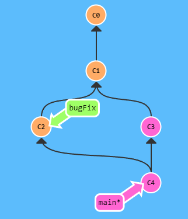

merge main to bugFix

```
git checkout bugFix;
git merge main;
```

merge bugFix to main

```
git checkout main;
git merge bugFix;
```

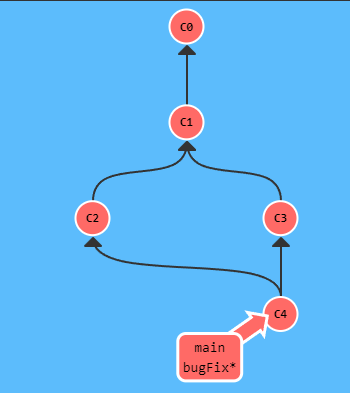

## rebase ( 另一種合併方式 )

rebasing 是 merge branch 的第二種方法。rebasing 就是取出一連串的 commit，"複製"它們，然後把它們接在別的地方。

雖然聽起來難以理解，rebasing 的優點是可以建立更線性的 commit history。假如只允許使用 rebasing 的話，則我們的 repo 中的 commit log 或者是 commit history 會更加簡潔好看。
用法 :
在需要被合併的分支上使用 rebase 合併至指定分支

總結 :
rebase 執行後會將被合併 branch 的 commit history 插入一份在合併後的 branch 上。
藉此可以獲得更加乾淨的 commit history。
! 但可能覆蓋原始的 branch history

### rebase 的`-1`模式

在使用 rebase 的時候加上 `-i`

```
git rebase -i HEAD~4 //從目前的位置到往上數4個 commit 中間的所有 commit
```

```
git rebase -i main //從目前的位置到 main 中間的所有 commit
```

相當於 :
獲取一個 UI 視窗，並可以在這個 UI 中對 HEAD 往上數 4 個 commit 進行以下操作

-   調整提交的順序：只需通過移動列表中的行來重新排序它們。
-   挑選或丟棄某個提交：可以選擇保留或刪除某個提交。
-   合併多個提交：使用 squash 或 fixup 來合併提交。
-   修改提交訊息：使用 reword 來更改提交訊息。
-   編輯提交的內容：使用 edit 來修改提交的內容。
    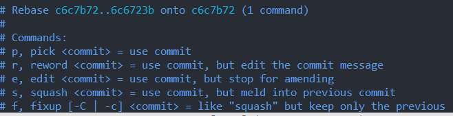

### 常用於 :

定期使用 rebase 將 main 的 commit 帶入至目前的 branch 中。
但是當目前 branch 被 push 之後要小心使用 ， 因為會修改 commit history。

在 bugFix 上
將 bugFix 的 commit history 更改為 main 的最新 commit

```
git checkout bugFix; //切換至 bugFix
git rebase main
// 將 bugFix 上的 commit history 變更為 main 的最新 commit
```

實際上做的事情 :

1. 將 bugFix 與 main 不同的 commit 取出，並保存在 patch 。
2. 將 bugFix 分支 reset 為 main 的最新 commit。
3. 最後將剛剛存於 patch 的 commit history 更新至目前的 bugFix 的 commit。
   tip :
   ! 當 bugFix 被 push 之後，因為 history 被變更，所以會出問題，可能會需要使用 git push --force，
   所以在一開始使用 rebase 的時候就要注意。

## 什麼是 HEAD

HEAD 是一個指向目前所在 commit 的 reference ,也就是當前位置。

在 commit tree 中， HEAD 總是指向最近的一次 commit。
大部分 git 指令要修改 commit tree 的狀態都會先改變 HEAD 的指向。

HEAD 通常指向一個 branch 的名稱（比如 bugFix）。當你 commit 的時候，改變了 bugFix 的狀態，這一個變化可以從 HEAD 的改變中看到。

### 分離 HEAD

使用 checkout 讓 HEAD 指向一個 commit 而不是 branch 的名稱。
執行前

```
HEAD -> main -> C1
```

執行後

```
git checkout C1
```

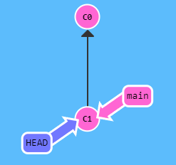

執行上面的 code 之後， HEAD 會直接指向 C1 而不是跟隨 main

## 相對引用

使用 git log 查詢 hash value
! 可以不用完整的輸入 hash value 只要是能夠辨識出唯一 value 即可。

常用 :
`^` : 向上移動一個 commit。
`~<num>` : 向上移動多個 commit。
`~` or `~<num>`: 向上移動幾個 commit 不使用 number 表示一格

舉例 :

```
git checkout main^
```

實際上:

## 切換至 main 的 parent commit

從目前的 commit 向上移動:

```
git checkout HEAD^
```

### 移動分支

前提 : 要移動目標前 HEAD 要位於該目標。

-   git branch -f : 強制移動分支 (就算有還沒合併的變更)

將 main 移動至 C6

```
git branch -f main C6
```

## 取消 git 的修改

透過 `git reset` & `git revert`
`git reset` : 將目前 branch 的 reference 退回上一個 commit。

```
git reset HEAD~1
```

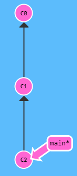
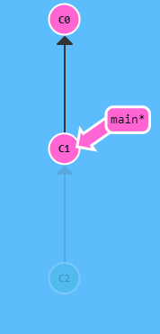

`git revert` :為了取消修改並且把這個狀態分享給別人，我們需要使用 git revert。

```
git revert HEAD
```

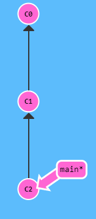
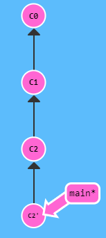

差異在於:
新的 commit C2' 引入了修改——用來表示我們取消 C2 這個 commit 的修改。

`git reset`:

1. --soft

    1. 只移動 HEAD 指針，不改變暫存區和工作目錄。
    2. 用途：當您想要重新提交（例如，更改提交訊息或合併多個提交）時，這是一個很好的選擇。

2. --mixed (default)

    1. 移動 HEAD 指針，並重設暫存區，但不改變工作目錄。
    2. 用途：當您想要取消最近的提交，但仍想保留工作目錄中的更改以進行進一步的修改時，這是一個很好的選擇。

3. hard
    1. 移動 HEAD 指針，重設暫存區，並且清除工作目錄中的所有更改。
    2. 用途：當您想要完全撤銷最近的提交，並且不希望保留任何更改時，這是一個很好的選擇。

diff:
這三種模式的差異主要在於它們對 HEAD 指針、暫存區和工作目錄的影響。使用 git reset 前，建議確定您了解這些模式的影響，以避免意外的結果。

### git reset HEAD & git reset HEAD^ 差異

`git reset HEAD` :
當 git add 將更改添加到暫存區，但後來決定不想提交這些更改時，可以使用此命令來取消暫存。

`git reset HEAD^` :
這個命令將 HEAD 指針移動到前一個提交，即撤銷最後一次提交。它會影響提交歷史。
^ 符號表示提交的父提交，所以 HEAD^ 是指當前分支的最新提交之前的那個提交。
使用此命令，您的最後一次提交將被撤銷，但該提交的更改仍會保留在您的工作目錄中（如果使用默認的 --mixed 模式）。

總結 :
`git reset HEAD` 主要用於取消暫存的更改，而 git reset HEAD^ 用於撤銷最後一次提交。

## git cherry-pick

當想要複製幾個 commit 並接在目前的 HEAD 下方
用法 : 在當前位置 選取想要添加的 commit
origin:
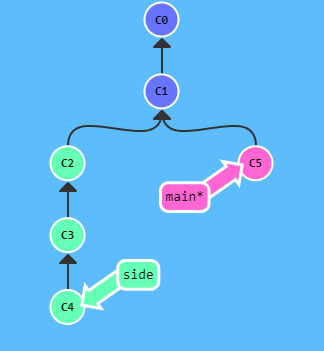

```
git cherry-pick C2 C4
```

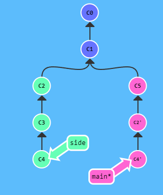

透過 cherry-pick 複製 C2 & C4 到 main 下方

## 在 local 的堆疊的 commit

情境 :
在 bugFix 分支中做了大量的 commit，當 bug 修復後需要合併至 main 的時候，直接使用 merge 會導致 main 被加上包含 debug 指令的 commit。

這時候可以透過 `git rebase -i` or `git cherry-pick` 獲取特定的 commit 並合併至 main
//目前位於 bugFix

```
git rebase -i main //開啟一個 UI 視窗，從 bugFix ~ main 中所有 commit 中，選取自己要的 commit 接到 main 後面
git branch -f main bugFix //將 main 移動至 合併後的 bugFix 位置
```

## commit 的戲法

情境 :
假設已經在 newImage branch 上做了一些 commit，然後又開了一個 branch 叫做 caption ，並且在上面做了一些相關的 commit ，因此它們看起來是一個接著一個的。

有點棘手的就是有時候你又想在之前的 commit 裡面做一些修改。在這個例子裡面，我們要去稍微修改一下 newImage 所指向的 commit，儘管已經是之前的 commit 了 。

解決方案 :
先用 git rebase -i 將 commit 重新排序，然後把我們想要修改的 commit 移到最前面
然後用 git commit --amend 來進行一些修改
接著再用 git rebase -i 來將他們按照最開始的順序重新排好
最後我們把 main 移到這個修改的最前端（用你自己喜歡的方法），就大功告成啦！

```
git rebase -i HEAD~2 //列出最近的兩次 commit 修改選中的 commit
git rebase -i HEAD~2 // ..
git rebase caption main //將 caption 分支上的變更合併至 main
```

## commit 的戲法 - 2

情境 :
當使用前面的方式，進行大量操作的時候，會有 rebase -i 後不一定記得位置的問題。

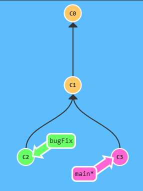

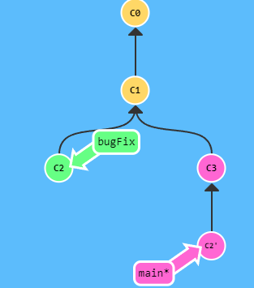

修改一個 commit 叫做 C2，但你要避免使用 rebase -i

```
git checkout main
git cherry-pick C2
git checkout main
git cherry-pick C2' C3
```

## git tag ( 指向固定的 commit )

在 C1 上面添加一個名為 v1 的標籤

```
git tag v1 C1
```

## git describe ( 尋找最近的 tag )

使用方式 :
`git describe <ref>` ( ref 是任何一個 commit 不填寫就是默認為 HEAD )

output

```
<tag>_<numCommits>_g<hash>
//<tag> 表示的是離 <ref> 最近的 tag， numCommits 是表示這個 tag 離 <ref> 有多少個 commit， <hash> 表示的是你所給定的 <ref> 所表示的 commit 的前七個 id。
```

**example** :

```
git tag v2 C3
```

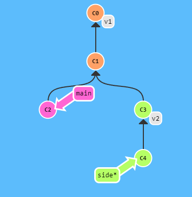

git describe main:

```
v1_2_gC2
```

git describe side:

```
v2_1_gC4
```

## rebase 多個 branch

情境 : 透過 rebase 進行不同 branch 的排序
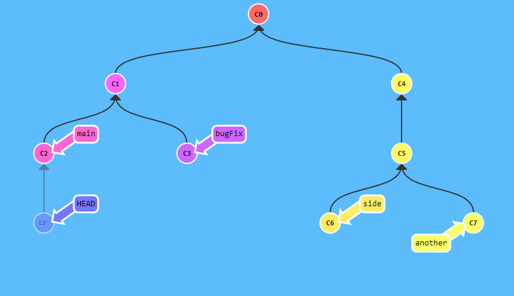

```
git rebase main bugFix
```

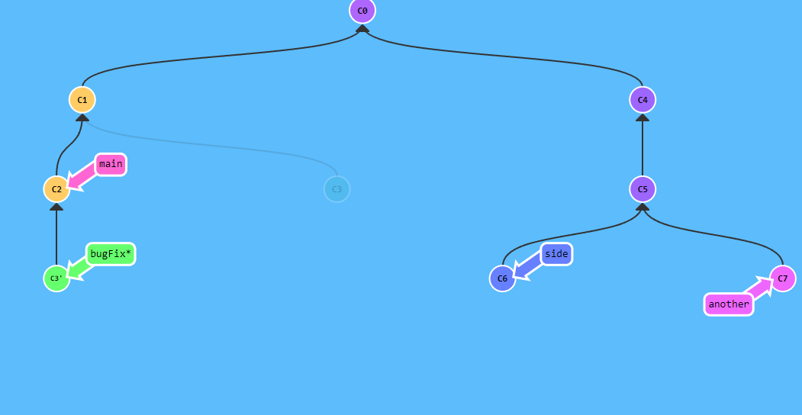

```
git rebase bugFix side
```

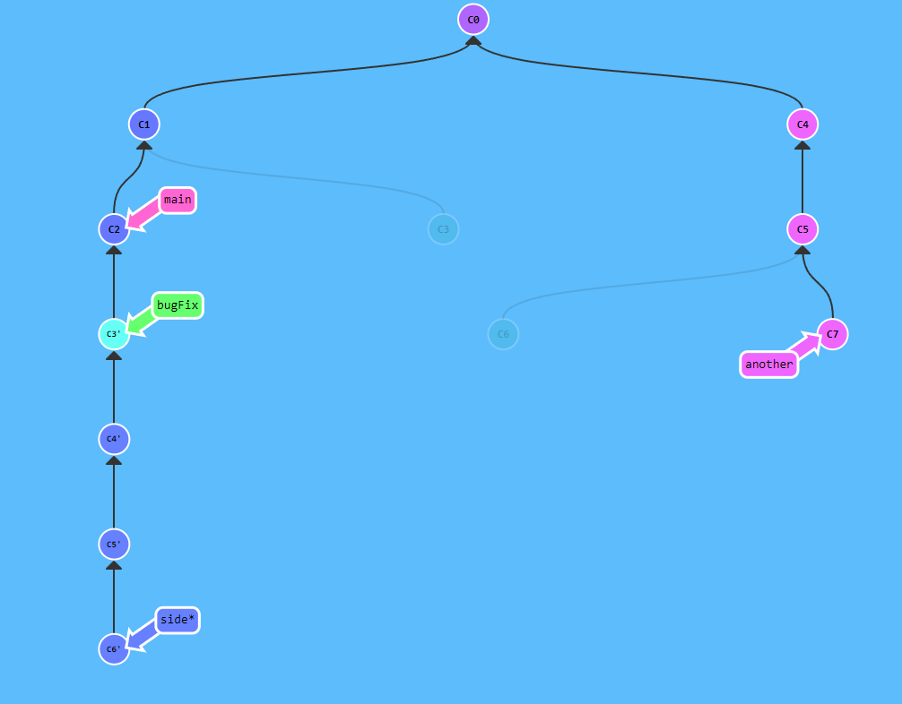

```
git rebase side another
```

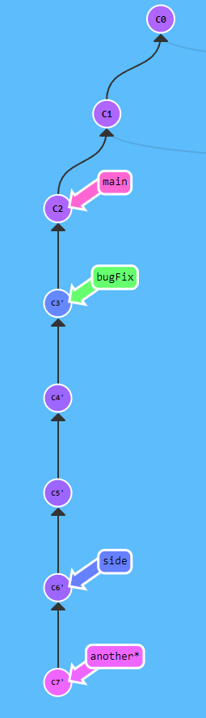

```
git rebase another main
```

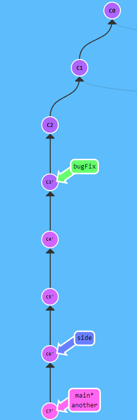

## 選擇 parent commit

和 `~` 符號一樣，`^` 符號的後面也可以接一個（可選的）數字。
用於表示選擇哪一個 parent commit
git 預設 merge 後選擇第一個 parent commit

**example** :

```
git checkout HEAD^
```

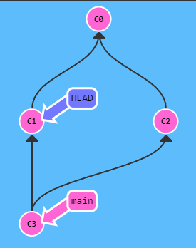

```
git checkout HEAD^2
```

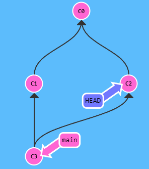

---

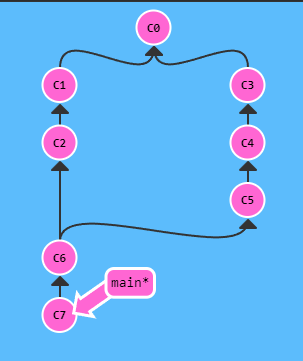

```
 git checkout HEAD~;
 git checkout HEAD^2;
 git checkout HEAD~2
```

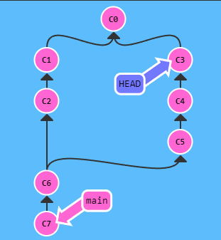

### 組合

```
 git checkout HEAD~;
 git checkout HEAD^2;
 git checkout HEAD~2
```

等同於

```
 git checkout HEAD~^2~2
```

### test

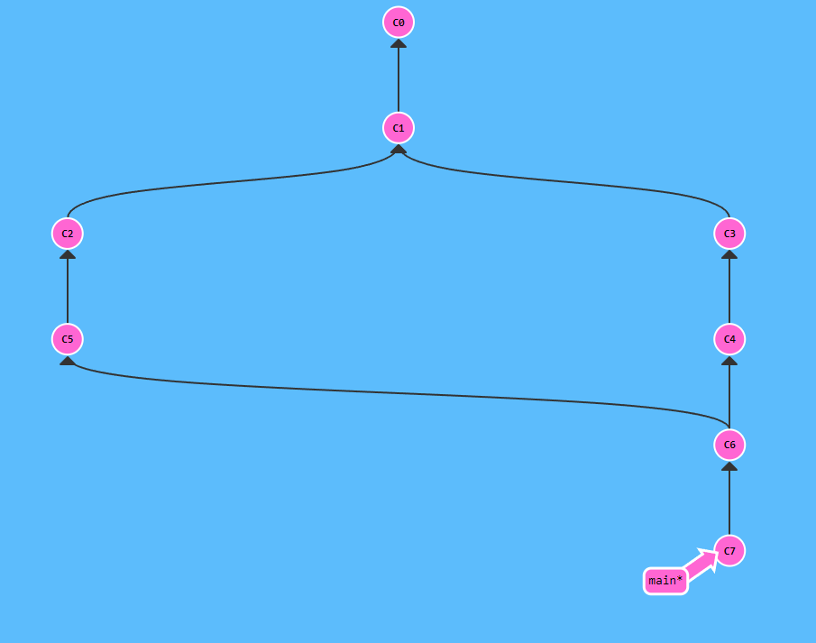
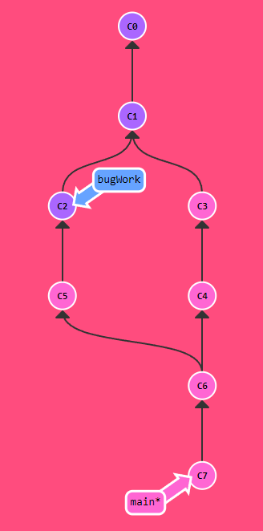

```
git checkout main^^2^ //從 main 往上一層的第二個分支在往上一層
git branch bugWork //建立分支
git checkout main // 回到 main
```

等同於

```
git branch bugWork main^^2^ //在從 main 往上一層的第二個分支在往上一層建立 bugWork 分支
```

## Branch Spaghetti

情境 :
現在我們的 main branch 是比 one two 和 three 這三個 branch 多了幾個 commit。由於某種原因，我們需要將 main 所新增的幾個 commit 套用到其它三個 branch 上面。

one branch 需要重新排序和取消 C5 這一個 commit， two 需要完全重排，而 three 只需要再一個 commit。
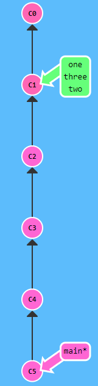
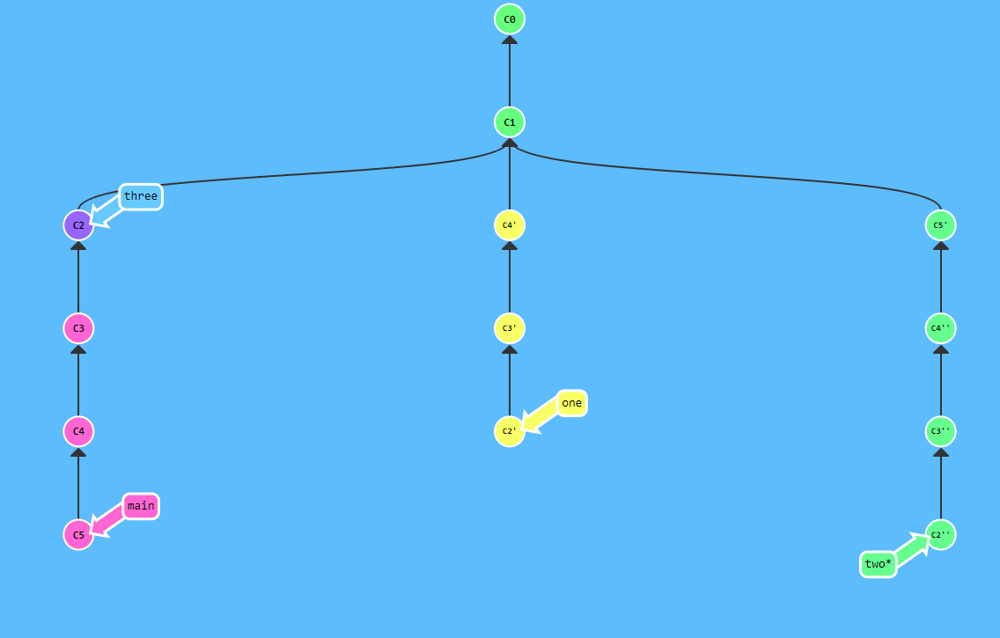

```
git checkout one
git cherry-pick C4 C3 C2
git checkout two
git cherry-pick C5 C4' C3' C2'
git branch -f three C2
```
