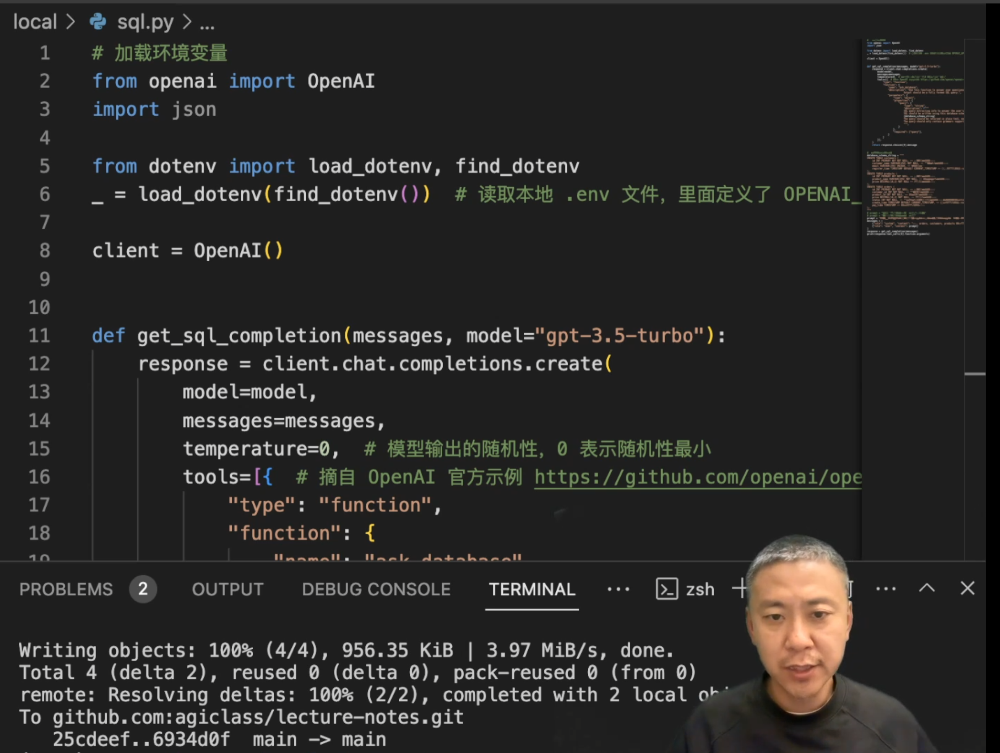
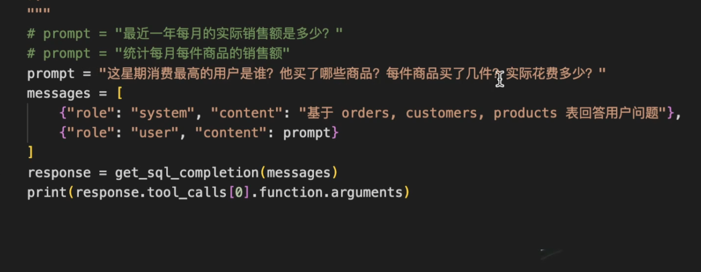
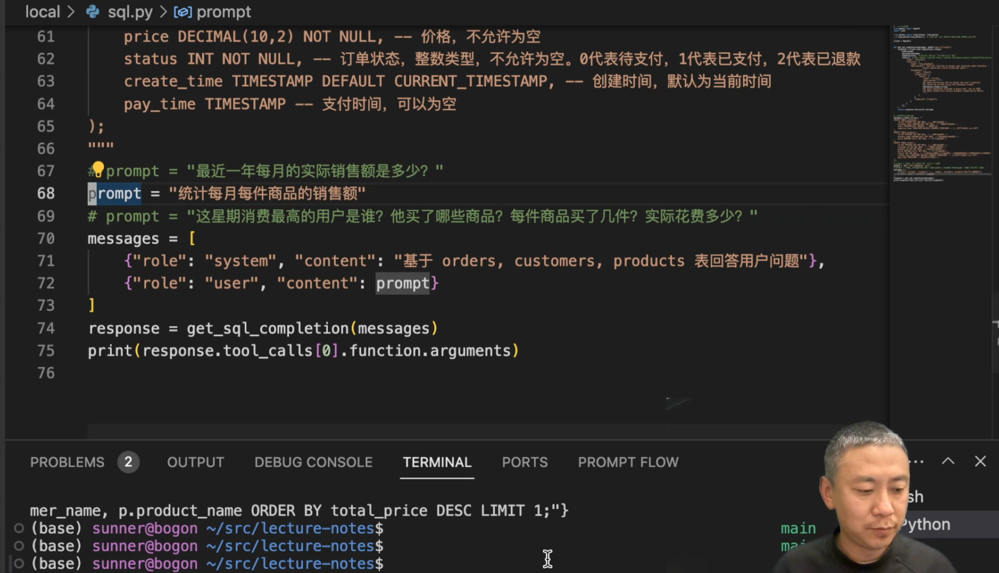

# 大模型應用開發

- 如何結合商業 科技 打造產品

AI 三類人
- 使用者: 使用AI產品
- 產品開發者: 設計 & 開發AI產品
- 基礎大模型相關: 訓練模型, 或是為大模型提供基礎設施

## 大模型為應用曾技術帶來的核心變化
- 調用大模型相當於調動一個人
- 懂人話
- 說人話
- 直接給結果，但不一定對

* 把 AI 當人看
- 范氏變化所在， 所有方案的源泉

布置任務>查數據>對話>prompt engineering
新知識>報稅>學習資料>RAG
深度理解>學新語言>好好學習>Fine-tuning
對接外界>獲知天氣>各種工具>function calling
解決複雜文提>工程項目>能力綜合>Agent

## 技術路線
* 大模型只能從 prompt ( 唯一接口接收資料 )

### prompt Engineering: 提示字工程
溝通上仿照人類
- 指令具體
- 信息豐富
- 盡量少歧意

## 知識輸入
### RAG
適用於: 智能知識庫, 智能診斷, 數字分身, 帶例子的 prompt Eng(Few-shot)
- LLM 要從向量數據庫找到類似的資料
    - EX 從數據庫找出相關資料

### Fine-tuning
- 成本&難度 > RAG 但效果可能更好
透過在基礎大模型之上建立垂直大模型進行細部調整

## 界接外界
### function calling
* 用 JSON 格式提供
透過提供類似於callback function 的方式
- 提供外部 apis 讓大模型可以更好的執行工作

### 技術架構

- 用好 AI = 當人用
- 技術框架
- Roadmap
https://agiclass.feishu.cn/docx/Z3Aed6qXboiF8gxGuaccNHxanOc

## 落地核心難點
- 與業務結合
- 了解業務
- 了解 AI 能力上限
- 找到綜合解決方案
- 透過 code 實現

-----
- 懂業務
- 懂AI
- 懂代碼

# 應用
## 行程規劃 AI 
## AI 導遊   

##
NL TO SQL 自然語言 轉 資料語言

透過 function calling 基於

## 架構設計
- 要讀別人的軟件的成熟代碼 學習別人的架構
- 自己去設計 & 實踐
- 

## AI 能力定律
- AI能力上限 === 使用者的判斷力
    - AI 的輸出 超過使用者的判斷力時 對使用者來說是沒有價值的
